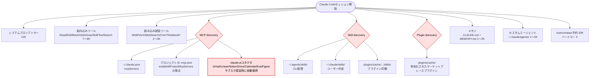
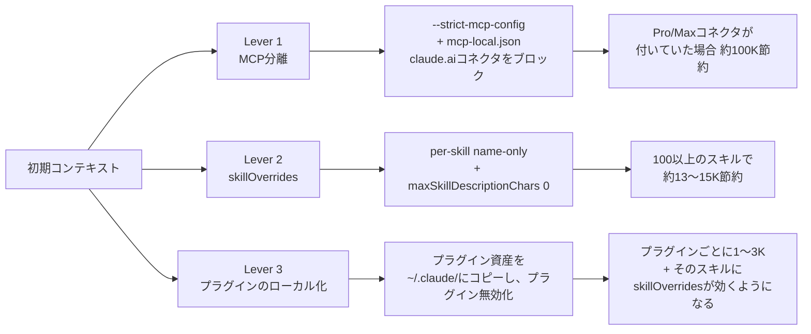
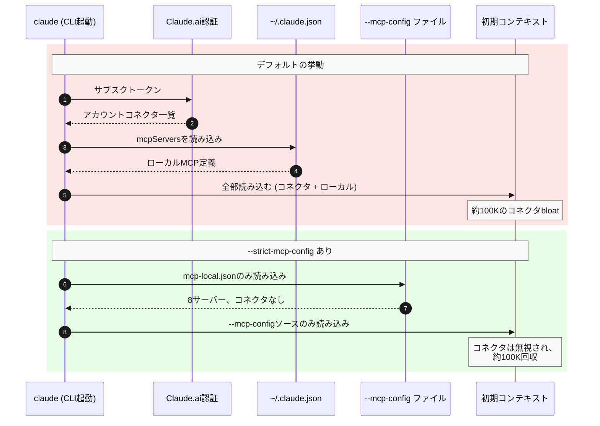
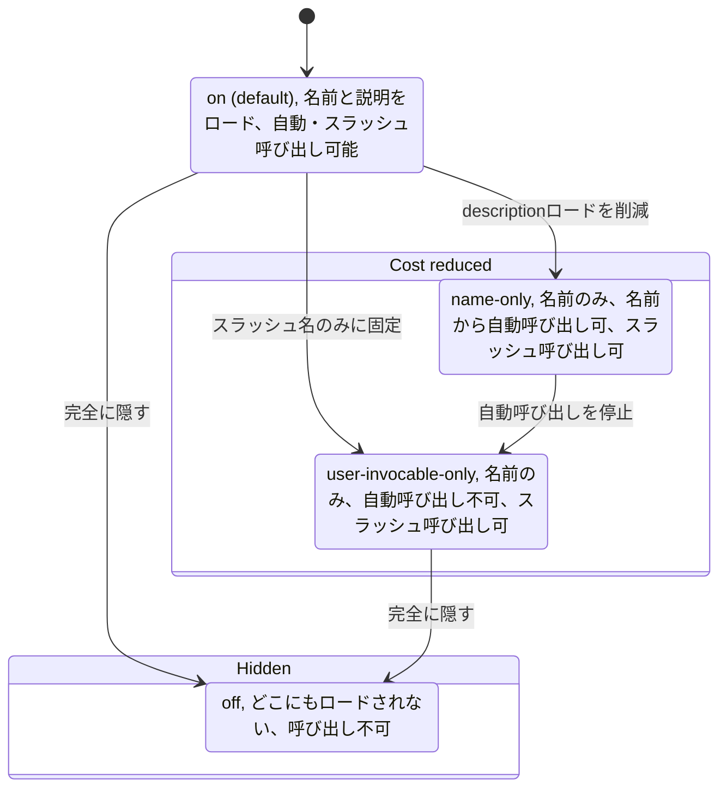
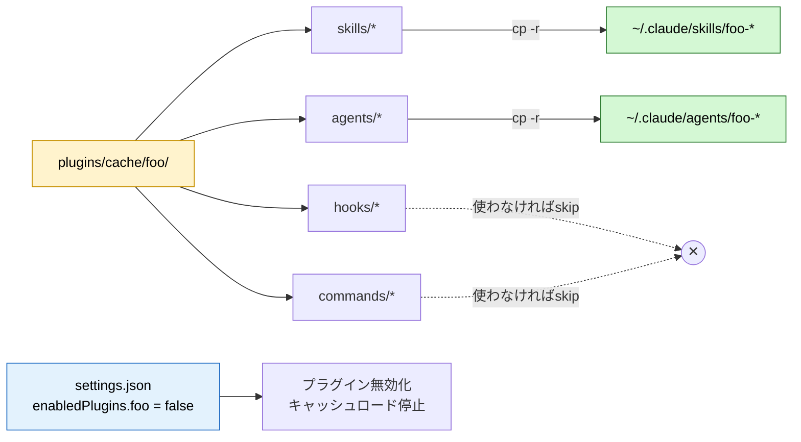

# Claude Codeの初期コンテキスト肥大化を削減する — MCP、Skills、プラグイン活用術

## スクリーンショット1枚で分かる問題

新しいClaude Codeセッションを開き、「hi」と入力して `/context` を確認してみてください。ヘビーユーザー向けの構成（MCPサーバー22個以上、スキル100個以上、プラグイン半ダース）だと、結果はかなり厳しいものになります。

```
Total: 33.8k / 200k tokens (17%)
- System prompt:           8.4k  (4.2%)
- System tools:            987   (0.5%)
- MCP tools (deferred):    67.6k (33.8%)  ← 最大の犯人
- System tools (deferred): 24.9k (12.4%)
- Custom agents:           1.3k  (0.6%)
- Memory files:            8.1k  (4.1%)
- Skills:                  15k   (7.5%)
- Messages:                13 tokens
- Autocompact buffer:      33k   (16.5%)  ← 予約領域、ハードコード
```

会話が始まる前に6万6千トークンが消えています。以下では、各バケツに実際に何が含まれているのか、ローダーの挙動を説明する**公式ドキュメント**、そして機能を失わずに数字を下げるための3つの設定レバーを紹介します。

---

## Claude Codeがデフォルトで読み込むもの

起動時のペイロードは、固定のシステムプロンプトに加えて**動的に発見される**複数のリソースの合計です。それぞれの発見パスはドキュメント化されていますが、コストが必ずしも分かりやすいわけではありません。



赤く塗られたノードが、これから操作する**3つのレバー**です。それ以外は固定（システムプロンプト、組み込みツール、autocompactバッファ）か、影響が小さいもの（メモリ、エージェント）です。

### 公式ドキュメントによる各ローダーの説明場所

| ローダー | 挙動 | ソース |
|---|---|---|
| MCPサーバー+instructions | 接続された各サーバーはツール名・説明・*instructions文字列* を寄与する。instructionsはTool Searchで**遅延されない** | [Claude Code MCPドキュメント](https://code.claude.com/docs/en/mcp), [Issue #48680](https://github.com/anthropics/claude-code/issues/48680) |
| claude.aiコネクタ | Pro/Maxサブスクで認証すると、アカウントレベルのコネクタ（Gmail、Linearなど）が自動アタッチされ、約100Kのツール定義が読み込まれる | [Issue #20412](https://github.com/anthropics/claude-code/issues/20412), [Issue #44112](https://github.com/anthropics/claude-code/issues/44112) |
| Skills | 各 `SKILL.md` のフロントマター（`name` + `description`）が連結されてリストになり、システムプロンプトに含まれる | [Claude Code Skills](https://code.claude.com/docs/en/skills), [agentskills.io spec](https://agentskills.io/client-implementation/adding-skills-support) |
| Skill発見パス | 4箇所をスキャン: `~/.<client>/skills/`、`~/.agents/skills/`、およびプロジェクトレベル相当 | [Agent Skills client implementation](https://agentskills.io/client-implementation/adding-skills-support#where-to-scan) |
| プラグイン | マーケットプレースプラグインはhooks/agents/skills/commandsを `plugins/cache/` に配置する。**プラグインのスキルは `skillOverrides` で制御不可** | [Pluginドキュメント](https://code.claude.com/docs/en/plugins), [Skills overrideノート](https://code.claude.com/docs/en/skills) |
| Autocompactバッファ | ウィンドウの先頭に33K予約。環境変数オーバーライドは*トリガー閾値*をずらすだけで、予約サイズは変わらない | [Issue #43928](https://github.com/anthropics/claude-code/issues/43928), [Issue #44536](https://github.com/anthropics/claude-code/issues/44536) |
| Tool Search "auto" モード | コンテキスト圧力が10%を超えた時にツールの*定義*（instructionsではなく）を遅延する。ただし複数の既知のリークパスあり | [Tool Search SDK](https://code.claude.com/docs/en/agent-sdk/tool-search), [APIリファレンス](https://platform.claude.com/docs/en/agents-and-tools/tool-use/tool-search-tool), [Issue #18370](https://github.com/anthropics/claude-code/issues/18370) |

この記事の元ネタとなった2つのコミュニティ記事: Scott Spence氏の[Optimising MCP Server Context Usage](https://scottspence.com/posts/optimising-mcp-server-context-usage-in-claude-code) (66K → 5.6K) と、atcyrus氏の[MCP Tool Search Context Pollution Guide](https://www.atcyrus.com/stories/mcp-tool-search-claude-code-context-pollution-guide)。

---

## 3つのレバー



各レバーは、最初のプロンプトが処理される前にローダーが歩く発見パスを攻撃します。

---

## Lever 1 · MCP — Claude Codeをclaude.aiコネクタから分離する

### サブスクリプション認証の隠れたコスト

ProまたはMaxサブスクリプションを使っている場合、サインインするとclaude.ai上で設定したアカウントレベルの**MCPコネクタ**（Gmail、Linear、Notion、Google Drive、Google Calendar、Exa、Figma…）をClaude Codeが取得します。Web上では便利ですが、CLIでは使う予定があろうとなかろうと**約100Kトークン**のツール定義を読み込みます。

v2.1.144時点では、コネクタの読み込みをクライアント単位で無効にする**ファーストパーティの設定はありません**。複数のオープンissueでこの機能リクエストが追跡されています: [#20412](https://github.com/anthropics/claude-code/issues/20412), [#47881](https://github.com/anthropics/claude-code/issues/47881), [#50062](https://github.com/anthropics/claude-code/issues/50062), [#56773](https://github.com/anthropics/claude-code/issues/56773).

ドキュメント化されている回避策は `--strict-mcp-config` フラグです。

### Before / After のフロー

以下のシーケンス図は、2つの起動パスを対比します。デフォルトのフロー（ステップ1〜5）はアカウントレベルのclaude.aiコネクタとローカルのMCPサーバーの両方をコンテキストに引っ張ってきますが、`--strict-mcp-config` のフロー（ステップ6〜8）は渡したファイルだけを読み、コネクタを完全に無視します。



### セットアップ

1. **ローカル専用のMCP設定を切り出す。** あなたの正規MCPサーバー一覧は `~/.claude.json` にあり、切り出すのは `mcpServers` だけです:

   ```bash
   jq '{mcpServers}' ~/.claude.json > ~/.claude/mcp-local.json
   ```

2. **`claude` をラップしてフラグが常に適用されるようにする。** Fishだとクリーンに書けます — fish特有のalias再帰を避けるため `command` プレフィックスを忘れずに:

   ```bash
   # ~/.config/fish/functions/claude.fish
   function claude
       command claude \
           --strict-mcp-config \
           --mcp-config ~/.claude/mcp-local.json $argv
   end
   ```

   Bash/zsh等価物も同じ要領 (`function claude() { command claude ... }`)。

3. **claude.ai側のコネクタ接続はそのままにする。** WebのCowork体験とClaude Desktopのチャットでは引き続き使えます。無視されるのはCLIだけです。

これを正当化する `claude --help` の抜粋:

> `--strict-mcp-config` — Only use MCP servers from `--mcp-config`, ignoring all other MCP configurations.

### 注意: カタログツールによるドリフト

MCPサーバーを管理するGUI/カタログツールを使っている場合、ほぼ確実に `~/.claude.json`（正規ファイル）に書き込みます。一方、strict-mcp-configのラッパーは `~/.claude/mcp-local.json` から読みます。この2つのファイルはツールがサーバーを追加・削除するたびに**ドリフト**するので、`jq` で再同期が必要です。カタログツールを使っていなければ気にする必要はありません。

---

## Lever 2 · Skills — `skillOverrides` を正しく使う

### Skillsバケットに何が入っているか

起動時に発見される各 `SKILL.md` は、`name`（数トークン）と `description`（`maxSkillDescriptionChars` まで、デフォルト**1536**）をシステムプロンプトのスキルリストに寄与します。スキル約100個のユーザーは、ここで簡単に15Kトークンを焼き払えます。

### 4つの状態 (2026年5月修正)

`skillOverrides` は**スキル単位のオブジェクト**で、ディレクトリ名がキーになります。以前自分のリサーチノートで公開していた推奨設定で*文字列*形式 (`"skillOverrides": "user-invocable-only"`) を使っていましたが、その形式は**JSONスキーマ検証に失敗**します。オブジェクト形式だけがサポートされています。

以下のstate図は、4つの正当な値と、コストを段階的に削減する遷移をマッピングしています: デフォルトの `on` 状態、2つのコスト削減状態（`name-only` は自動呼び出しを維持、`user-invocable-only` は明示的スラッシュ呼び出しを要求）、そして完全に隠す `off` 状態。



2つのコスト削減値の決定的な違いは**自動呼び出し**です。`user-invocable-only` は名前通りのことしかしません — スキルは `/skill-name` 経由でだけ到達可能。自動呼び出しはオフなので、タスクが自然にそのスキルを呼ぶような場合でもモデルは自発的に手を伸ばしません。`name-only` はリストに名前を残し、自動呼び出しも生かしておくので、タスクが必要とすればモデルが自分でロードして実行できます。

その差が、自分が全部 `name-only` を選んだ理由です。自分のフローの多くは `/goal "do X"` 形式の自然言語ディレクションで、モデル（あるいは産み出されたサブエージェント）が「あ、*qa-team* スキルがこれに合うな」と認識して、スラッシュコマンドをタイプしなくてもロードする必要があります。`user-invocable-only` だとそれを殺してしまい、スキル名を全部覚えてタイプしないといけなくなります。`user-invocable-only` は明示的呼び出しでゲートしたい稀なスキル用に取っておきますが、実際には今のところ自分にはそのバケツは空です。

### セットアップ

```bash
# ローカルで発見できる全スキルにname-onlyを適用
SKILLS=$(find ~/.claude/skills ~/.agents/skills -maxdepth 2 -name "SKILL.md" 2>/dev/null \
  | sed 's|.*/skills/||; s|/SKILL.md$||' | sort -u)

OVERRIDES=$(echo "$SKILLS" | jq -R . | jq -s 'map({(.): "name-only"}) | add')

jq --argjson o "$OVERRIDES" '
  .skillOverrides = $o |
  .maxSkillDescriptionChars = 0 |
  .skillListingBudgetFraction = 0.005
' ~/.claude/settings.json > /tmp/s.json && mv /tmp/s.json ~/.claude/settings.json
```

3つの設定、3つの目的:

| 設定 | デフォルト | 自分の値 | 理由 |
|---|---|---|---|
| `skillOverrides` | `{}` | `{ <every-skill>: "name-only" }` | descriptionを落とし、自動/サブエージェント呼び出しは残す |
| `maxSkillDescriptionChars` | `1536` | `0` | descriptionを完全にドロップ — 名前だけ残る。オーバーライドし忘れたスキル用のハードな安全網 |
| `skillListingBudgetFraction` | `0.01` | `0.005` | スキルリストがウィンドウのどれだけを消費できるかの上限 |

編集後はClaude Codeを完全に再起動してください — スキルリストは現在のセッションでキャッシュされます。`/context` で `Skills` 行を確認しましょう。

### 注意点

- **プラグインのスキルは `skillOverrides` の影響を受けない。** これがLever 3の存在理由です。
- **ビルドバージョンが重要。** `skillOverrides` はv2.1.129まで壊れていました ([Issue #50631](https://github.com/anthropics/claude-code/issues/50631))。組み込みスキル対応も同じ修正で入りました ([Issue #26838](https://github.com/anthropics/claude-code/issues/26838))。`claude --version` で確認を。
- フロントマター等価物 `disable-model-invocation: true` と `user-invocable: false` も動作しますが、`skillOverrides` の方が一括適用に向いています。

---

## Lever 3 · プラグイン → ローカルスキル

マーケットプレースプラグインは便利ですが、hooks/agents/skills/commandsをまとめてバンドルで配信します。プラグインに含まれるスキルは `~/.claude/plugins/cache/.../skills/` に置かれ — 公式ドキュメント通り — **`skillOverrides` で黙らせることができません**。なので、自動呼び出ししないチャットだらけのスキル5個をプラグインが寄与している場合、何をしようとその5個のdescriptionが毎セッション読み込まれます。

回避策は、**実際に使うパーツをユーザー空間に昇格**させ、プラグインを無効化することです。



### 手順

1. **プラグインが何を提供しているか特定する。** 各プラグインのキャッシュディレクトリはソースの `skills/`、`agents/`、`hooks/`、`commands/` をミラーします。

   ```bash
   ls ~/.claude/plugins/cache/<plugin>@<marketplace>/
   ```

2. **使うものだけユーザー空間にコピー。**

   ```bash
   cp -r ~/.claude/plugins/cache/codex@openai-codex/skills/codex-cli-runtime \
         ~/.claude/skills/

   cp -r ~/.claude/plugins/cache/coderabbit@claude-plugins-official/agents/code-reviewer \
         ~/.claude/agents/
   ```

3. **プラグインを無効化。** `~/.claude/settings.json` の `enabledPlugins` からそのキーを削除するか、`claude plugin uninstall <plugin>@<marketplace>` を実行します。

4. **ローカル化したスキルを `skillOverrides` に追加。** もうユーザースキルなので、§2のレバーが適用できます。状況に応じて `name-only` または `user-invocable-only` を。

5. **プラグインが更新されたら**、再コピーが必要です。トレードオフは意識的なものです: 自動更新を捨てて `skillOverrides` の制御権と低いsteady-stateコンテキストコストを得る、ということ。たまにしか使わないプラグインなら、このトレードは価値があります。

### 最近ローカル化したもの

| プラグイン | 残したもの | 無効化 | 回収トークン |
|---|---|---|---|
| `codex@openai-codex` | `codex-rescue` エージェント、`codex-cli-runtime` / `codex-result-handling` / `gpt-5-4-prompting` スキル | yes | 約1.4K (加えて `skillOverrides` のリーチ回復) |
| `coderabbit@claude-plugins-official` | `code-reviewer` エージェント、`autofix` / `code-review` スキル | yes | 約1K |
| `figma@claude-plugins-official` | グローバルでは何も — `zumen-fe` プロジェクト内でのみ `.claude/settings.local.json` で有効化 | yes (ユーザーレベル) | 約1.4K |
| `claude-md-management@claude-plugins-official` | 何も — 使わなかった | yes | 小 |

figmaのケースは触れる価値のある4つ目のパターンを示しています: **プラグインを1プロジェクトにスコープする**。ユーザーレベルで無効化し、単一プロジェクトの `.claude/settings.local.json` で再有効化:

```json
{ "enabledPlugins": { "figma@claude-plugins-official": true } }
```

そのプロジェクトに `cd` した時だけプラグインがロードされます。

---

## 現在の `settings.json` (削減後)

```json
{
  "$schema": "https://json.schemastore.org/claude-code-settings.json",
  "env": {
    "ENABLE_TOOL_SEARCH": "true",
    "CLAUDE_CODE_ENABLE_TELEMETRY": "0",
    "MAX_MCP_OUTPUT_TOKENS": "200000",
    "CLAUDE_CODE_EXPERIMENTAL_AGENT_TEAMS": "1",
    "CLAUDE_CODE_DISABLE_1M_CONTEXT": "1",
    "CLAUDE_CODE_EFFORT_LEVEL": "max"
  },
  "skillOverrides": {
    "<every-skill-name>": "name-only"
  },
  "maxSkillDescriptionChars": 0,
  "skillListingBudgetFraction": 0.005,
  "enabledPlugins": {
    "figma@claude-plugins-official": false,
    "codex@openai-codex": false,
    "coderabbit@claude-plugins-official": false,
    "claude-md-management@claude-plugins-official": false
  }
}
```

Lever 1の `--strict-mcp-config` ラッパーと組み合わせれば、これが完全なsteady-stateセットアップです。

---

## 検証

```mermaid
flowchart TD
    Start([settings.json /<br/>mcp-local.json を編集]) --> Restart[Claude Codeを<br/>完全に再起動]
    Restart --> Ctx{/context}
    Ctx -->|MCP tools deferred 減った?| Y1[Lever 1 効いてる]
    Ctx -->|Skills 行 減った?| Y2[Lever 2 効いてる]
    Ctx -->|Plugins 行 減った?| Y3[Lever 3 効いてる]
    Y1 --> Done([完了])
    Y2 --> Done
    Y3 --> Done

    Ctx -->|MCP まだ巨大| Debug1[/mcp 実行、<br/>コネクタが消えているか確認]
    Ctx -->|Skills 変わらず| Debug2[claude --version 確認<br/>≥ v2.1.129、再起動]
    Debug1 --> Done
    Debug2 --> Done
```

具体的には:

```bash
# 1. strict-mcp-config が効いているか確認
claude --debug 2>&1 | grep -i "strict\|mcp-config" | head -5

# 2. ローカルMCPだけがロードされているか確認
/mcp

# 3. コンテキスト内訳を検査
/context

# 4. Skills行がまだ大きい場合
claude --version   # v2.1.129以上である必要あり
jq '.skillOverrides | length' ~/.claude/settings.json   # スキル数と一致するはず

# 5. プラグインが無効か確認
jq '.enabledPlugins' ~/.claude/settings.json
```

---

## 注視すべき既知バグ

| Issue | ステータス | なぜ重要か |
|---|---|---|
| [#48680](https://github.com/anthropics/claude-code/issues/48680) | OPEN | MCP **サーバーinstructions** はTool Search遅延されない — 長文instructions (Serenaの20行以上のガイド、DeepWikiのツールカタログ) は設定にかかわらず常駐し続ける |
| [#40314](https://github.com/anthropics/claude-code/issues/40314) | CLOSED stale | HTTP/Streamable MCPサーバーは旧バージョンで全く遅延されない — アップグレード後 `/mcp` と `/context` で確認 |
| [#54716](https://github.com/anthropics/claude-code/issues/54716) | OPEN | 組み込み遅延ツール (約25K) にはまだopt-outなし |
| [#41809](https://github.com/anthropics/claude-code/issues/41809) | CLOSED | 無効化したMCPサーバーが以前は遅延リストに残っていた — 無効化後に確認 |
| [#43928](https://github.com/anthropics/claude-code/issues/43928) | OPEN | Autocompactバッファ (33K) はハードコード。トリガー閾値だけ `CLAUDE_AUTOCOMPACT_PCT_OVERRIDE` で調整可能 |
| [#50631](https://github.com/anthropics/claude-code/issues/50631) | v2.1.129で修正 | `skillOverrides` は旧ビルドではno-opだった — 計測前にアップグレード確認を |
| [#20412](https://github.com/anthropics/claude-code/issues/20412), [#44112](https://github.com/anthropics/claude-code/issues/44112) | OPEN | claude.aiコネクタのクライアント単位トグルなし — `--strict-mcp-config` が唯一のドキュメント化された脱出口 |
| [#18370](https://github.com/anthropics/claude-code/issues/18370) | OPEN | Tool Search `auto` モードが10%閾値を超えても起動失敗することがある — `ENABLE_TOOL_SEARCH=true` を明示的にセット |

より深いテイクアウェイ: ほとんどがアーキテクチャ周りのリークパスで、アーキテクチャ自体は遅延を*サポートしている*。修正は「遅延を切る」ことではなく、「遅延がリークする余地を残さないようにする」こと。それが3つのレバーが達成することそのものです。

---

## 採用しなかったもの

検討して却下したオプションをいくつか:

- **`ANTHROPIC_API_KEY` 認証に切り替える。** はい、ドキュメントはAPIキーセッションがclaude.aiコネクタ取得をスキップすることを確認しています。しかしMaxプランの特典を失います。`--strict-mcp-config` なら課金変更なしで同じコンテキスト節約が得られます。
- **`~/.claude.json` の `cachedGrowthBookFeatures.tengu_claudeai_mcp_connectors` を編集する。** サーバーが次のハンドシェイクで上書きします — [#44112](https://github.com/anthropics/claude-code/issues/44112) 参照。
- **全スキルを `off` にする。** クリーンな `/context` 出力には魅力的ですが、自動発見を全て失います。全スキル名を覚えないといけません。`name-only` の方が親切なデフォルトです。
- **Autocompactを無効化する。** 構造的にハードコードされています。`CLAUDE_AUTOCOMPACT_PCT_OVERRIDE` がトリガーを遅らせるだけで、予約は解放しません。

---

## 参考文献

### 公式ドキュメント

- [Claude Code Settings](https://code.claude.com/docs/en/settings)
- [Claude Code MCP](https://code.claude.com/docs/en/mcp)
- [Claude Code Skills](https://code.claude.com/docs/en/skills)
- [Claude Code Plugins](https://code.claude.com/docs/en/plugins)
- [Claude Code Changelog](https://code.claude.com/docs/en/changelog)
- [Agent SDK · Tool Search](https://code.claude.com/docs/en/agent-sdk/tool-search)
- [Tool Search API リファレンス](https://platform.claude.com/docs/en/agents-and-tools/tool-use/tool-search-tool)
- [Agent Skills spec — discovery paths](https://agentskills.io/client-implementation/adding-skills-support#where-to-scan)
- [Anthropic Engineering — Advanced tool use](https://www.anthropic.com/engineering/advanced-tool-use)

### この記事の元ネタになったコミュニティ記事

- Scott Spence — [Optimising MCP Server Context Usage in Claude Code](https://scottspence.com/posts/optimising-mcp-server-context-usage-in-claude-code)
- atcyrus — [MCP Tool Search Context Pollution Guide](https://www.atcyrus.com/stories/mcp-tool-search-claude-code-context-pollution-guide)
- Paddo — [MCP Context Isolation via Slash Commands](https://paddo.dev/blog/claude-code-mcp-context-isolation/)
- candede — [Solving MCP Context Bloat](https://www.candede.com/articles/claude-tool-search)
- Joe Njenga — [46.9% reduction (51K → 8.5K)](https://medium.com/@joe.njenga/claude-code-just-cut-mcp-context-bloat-by-46-9-51k-tokens-down-to-8-5k-with-new-tool-search-ddf9e905f734)
- claudefa.st — [Skill Listing Budget](https://claudefa.st/skill-listing-budget) と [Context Buffer Management](https://claudefa.st/context-buffer-management)

### 言及したツール

- [agent skills CLI](https://agentskills.io) — クロスクライアントスキルインストール用 `npx skills`

この演習をやって違うコスト分布になった人がいたら、ぜひ聞いてみたいです — リークパスはClaude Codeのリリースごとにシフトするし、次の6ヶ月のchangelogエントリでどのレバーが一番効くかは変わっていくはずです。

---

> 原文: [Cutting Claude Code's Initial Context Bloat — MCP, Skills, and Plugin Tactics](https://laststance.io/articles/Cutting-Claude-Code-Initial-Context-Bloat) (Ryota Murakami, 2026-05-21)
