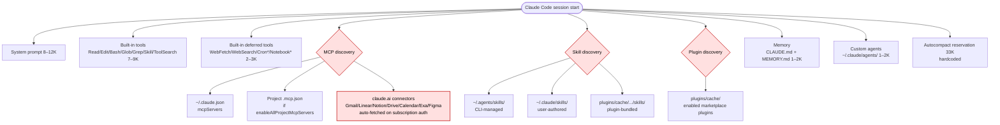
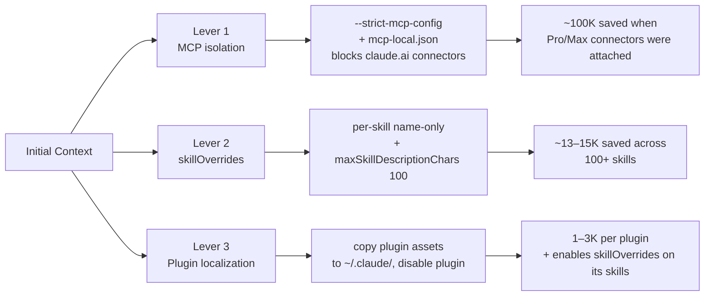
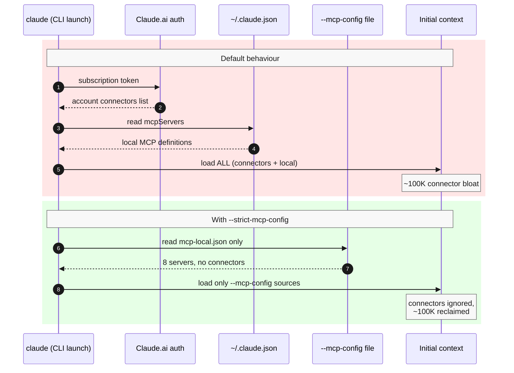
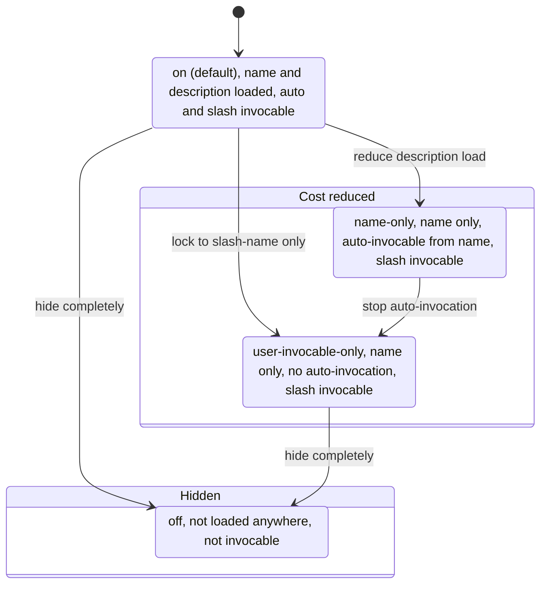
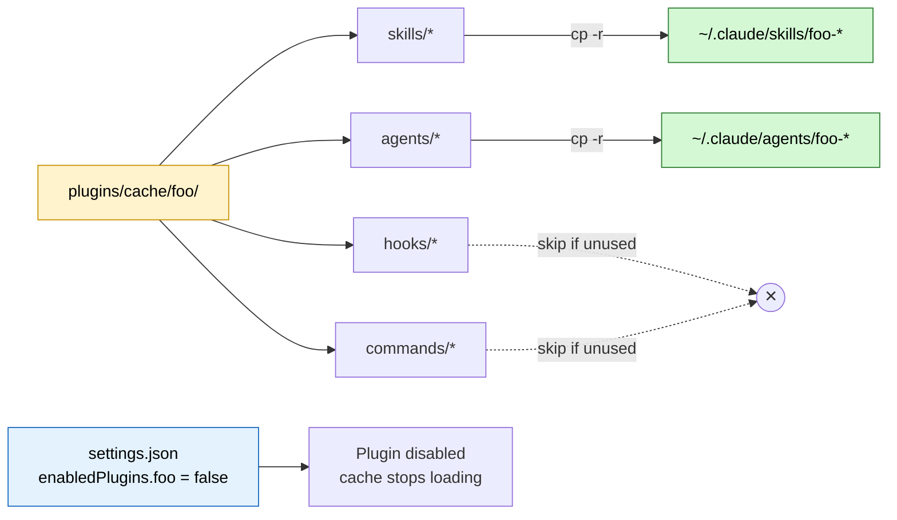
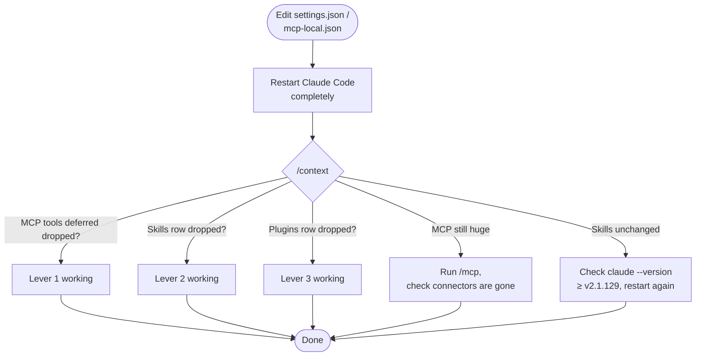

import { ArticleLayout } from '@/components/ArticleLayout'

export const article = {
  author: 'Ryota Murakami',
  title: "Cutting Claude Code's Initial Context Bloat — MCP, Skills, and Plugin Tactics",
  date: '2026-05-21',
  description:
    'A field guide to what Claude Code loads into context at startup, why it balloons to 50–70K tokens before you type anything, and three concrete levers (MCP isolation, skillOverrides, plugin localization) that brought my session down without losing functionality.',
}

export default (props) => <ArticleLayout article={article} {...props} />

## The Problem in One Screenshot

Open a fresh Claude Code session, type "hi", and check `/context`. On a heavy power-user config (22+ MCP servers, 100+ skills, half a dozen plugins) the answer is sobering:

```
Total: 33.8k / 200k tokens (17%)
- System prompt:           8.4k  (4.2%)
- System tools:            987   (0.5%)
- MCP tools (deferred):    67.6k (33.8%)  ← biggest culprit
- System tools (deferred): 24.9k (12.4%)
- Custom agents:           1.3k  (0.6%)
- Memory files:            8.1k  (4.1%)
- Skills:                  15k   (7.5%)
- Messages:                13 tokens
- Autocompact buffer:      33k   (16.5%)  ← reserved, hardcoded
```

Sixty-six thousand tokens are gone before the conversation begins. Below is what each of those buckets actually contains, the **official docs** that describe the loader, and the three settings levers that let me bring the number down without losing functionality.

---

## What Claude Code Loads By Default

The startup payload is the sum of a fixed system prompt plus several **dynamically discovered** resources. Each discovery path is documented but the costs are not always obvious.



The red-tinted nodes are the **three levers** we will operate. The rest is either fixed (system prompt, built-in tools, autocompact buffer) or marginal (memory, agents).

### Where the official sources describe each loader

| Loader | Behaviour | Source |
|---|---|---|
| MCP servers + instructions | Each connected server contributes its tool names, descriptions, and an *instructions string* — the instructions are **not** deferred by Tool Search | [Claude Code MCP docs](https://code.claude.com/docs/en/mcp), [Issue #48680](https://github.com/anthropics/claude-code/issues/48680) |
| claude.ai connectors | When you sign in with a Pro/Max subscription, account-level connectors (Gmail, Linear, etc.) are auto-attached and load ~100K of tools | [Issue #20412](https://github.com/anthropics/claude-code/issues/20412), [Issue #44112](https://github.com/anthropics/claude-code/issues/44112) |
| Skills | Each `SKILL.md` frontmatter (`name` + `description`) is concatenated into a listing that ships in the system prompt | [Claude Code Skills](https://code.claude.com/docs/en/skills), [agentskills.io spec](https://agentskills.io/client-implementation/adding-skills-support) |
| Skill discovery paths | Four locations are scanned: `~/.<client>/skills/`, `~/.agents/skills/`, and project-level equivalents | [Agent Skills client implementation](https://agentskills.io/client-implementation/adding-skills-support#where-to-scan) |
| Plugins | Marketplace plugins drop hooks, agents, skills, and commands into `plugins/cache/`; **plugin skills are not controllable via `skillOverrides`** | [Plugin docs](https://code.claude.com/docs/en/plugins), [Skills override note](https://code.claude.com/docs/en/skills) |
| Autocompact buffer | A 33K reservation at the top of the window; environment overrides only shift the *trigger threshold*, not the reservation size | [Issue #43928](https://github.com/anthropics/claude-code/issues/43928), [Issue #44536](https://github.com/anthropics/claude-code/issues/44536) |
| Tool Search "auto" mode | Defers tool *definitions* (not instructions) when context pressure exceeds 10%, but has multiple known leak paths | [Tool Search SDK](https://code.claude.com/docs/en/agent-sdk/tool-search), [API reference](https://platform.claude.com/docs/en/agents-and-tools/tool-use/tool-search-tool), [Issue #18370](https://github.com/anthropics/claude-code/issues/18370) |

Two community write-ups did most of the legwork that informed this article: Scott Spence's [Optimising MCP Server Context Usage](https://scottspence.com/posts/optimising-mcp-server-context-usage-in-claude-code) (66K → 5.6K) and atcyrus's [MCP Tool Search Context Pollution Guide](https://www.atcyrus.com/stories/mcp-tool-search-claude-code-context-pollution-guide).

---

## The Three Levers



Each lever attacks a discovery path that the loader walks before your first prompt is processed.

---

## Lever 1 · MCP — Isolate Claude Code from claude.ai Connectors

### The hidden cost of subscription auth

If you use a Pro or Max subscription, signing in tells Claude Code to fetch the account-level **MCP connectors** you configured on claude.ai (Gmail, Linear, Notion, Google Drive, Google Calendar, Exa, Figma…). These are convenient on the web but on the CLI they load **~100K tokens** of tool definitions whether or not you intend to use them.

There is — as of v2.1.144 — **no first-party setting** to disable connector loading per-client. Several open issues track the feature request: [#20412](https://github.com/anthropics/claude-code/issues/20412), [#47881](https://github.com/anthropics/claude-code/issues/47881), [#50062](https://github.com/anthropics/claude-code/issues/50062), [#56773](https://github.com/anthropics/claude-code/issues/56773).

The documented workaround is the `--strict-mcp-config` flag.

### Flow before and after

The sequence diagram below contrasts two startup paths: the default flow (steps 1–5) pulls both account-level claude.ai connectors and local MCP servers into context, while the `--strict-mcp-config` flow (steps 6–8) reads only the file you pass and ignores the connectors entirely.



### Setup

1. **Carve out a local-only MCP config.** Your canonical MCP server list lives in `~/.claude.json`; the carve-out is just `mcpServers`:

   ```bash
   jq '{mcpServers}' ~/.claude.json > ~/.claude/mcp-local.json
   ```

2. **Wrap `claude` so the flag is always applied.** Fish makes this clean — note the `command` prefix to dodge fish's infamous alias recursion:

   ```bash
   # ~/.config/fish/functions/claude.fish
   function claude
       command claude \
           --strict-mcp-config \
           --mcp-config ~/.claude/mcp-local.json $argv
   end
   ```

   Bash/zsh equivalents work the same way (`function claude() { command claude ... }`).

3. **Leave the connectors connected on claude.ai.** The web Cowork experience and Claude Desktop chat will keep them; only the CLI ignores them.

The `claude --help` excerpt that authorizes this:

> `--strict-mcp-config` — Only use MCP servers from `--mcp-config`, ignoring all other MCP configurations.

### Watch out: catalog-tool drift

If you use any GUI/catalog tool to manage MCP servers, it almost certainly writes to `~/.claude.json` (the canonical file), while the strict-mcp-config wrapper now reads from `~/.claude/mcp-local.json`. Those two files **drift** every time the tool adds or removes a server, and a re-`jq` is needed to resync. If you don't use a catalog tool you'll never notice this.

---

## Lever 2 · Skills — `skillOverrides` Done Right

### What lives in the Skills bucket

Every `SKILL.md` discovered at startup contributes a `name` (a few tokens) and a `description` (up to `maxSkillDescriptionChars`, default **1536**) to the system prompt's skill listing. A user with ~100 skills can easily burn 15K tokens here.

### The four states (corrected May 2026)

`skillOverrides` is a **per-skill object** keyed by directory name. A previously published recommendation in one of my own research notes used a *string* form (`"skillOverrides": "user-invocable-only"`) — that form **fails JSON schema validation**; the object form is the only one supported.

The state diagram below maps the four legal values and the transitions that progressively reduce cost: the default `on` state, two cost-reduced states (`name-only` keeps auto-invocation; `user-invocable-only` requires explicit slash invocation), and the fully hidden `off` state.



The pivotal difference between the two cost-reduced values is **auto-invocation**. `user-invocable-only` truly does only what its name says — the skill is reachable through `/skill-name`. Auto-invocation is off, so the model won't reach for the skill on its own when the task naturally calls for it. `name-only` keeps the name in the listing and leaves auto-invocation alive, so the model can decide to load and run the skill on its own when the task calls for it.

That distinction is why I picked `name-only` for everything. A lot of my flow is `/goal "do X"`-style natural-language direction where the model (or a subagent it spawns) needs to recognize "ah, the *qa-team* skill fits this" and load it without me typing the slash command. `user-invocable-only` would kill that and force me to remember and type every skill name. I keep `user-invocable-only` in reserve for the rare skill I want gated behind explicit invocation, but in practice that bucket is empty for me right now.

### Setup

```bash
# Apply name-only to every locally-discoverable skill
SKILLS=$(find ~/.claude/skills ~/.agents/skills -maxdepth 2 -name "SKILL.md" 2>/dev/null \
  | sed 's|.*/skills/||; s|/SKILL.md$||' | sort -u)

OVERRIDES=$(echo "$SKILLS" | jq -R . | jq -s 'map({(.): "name-only"}) | add')

jq --argjson o "$OVERRIDES" '
  .skillOverrides = $o |
  .maxSkillDescriptionChars = 100 |
  .skillListingBudgetFraction = 0.005
' ~/.claude/settings.json > /tmp/s.json && mv /tmp/s.json ~/.claude/settings.json
```

Three settings, three purposes:

| Setting | Default | My value | Why |
|---|---|---|---|
| `skillOverrides` | `{}` | `{ <every-skill>: "name-only" }` | Drop descriptions, keep auto/subagent invocation |
| `maxSkillDescriptionChars` | `1536` | `100` | Truncates descriptions on any skill I leave at `on` — a safety net |
| `skillListingBudgetFraction` | `0.01` | `0.005` | Hard ceiling on how much of the window the skill listing can consume |

Restart Claude Code completely after editing — the skill listing is cached for the current session. Verify with `/context` and look at the `Skills` row.

### Caveats

- **Plugin skills are not affected by `skillOverrides`.** That is the whole reason Lever 3 exists.
- **Build version matters.** `skillOverrides` was broken until v2.1.129 ([Issue #50631](https://github.com/anthropics/claude-code/issues/50631)). Built-in skill support landed in the same fix ([Issue #26838](https://github.com/anthropics/claude-code/issues/26838)). Confirm with `claude --version`.
- The frontmatter equivalents `disable-model-invocation: true` and `user-invocable: false` work too, but `skillOverrides` is faster to bulk-apply.

---

## Lever 3 · Plugin → Local Skill

Marketplace plugins are convenient but they ship a bundle: hooks, agents, skills, and commands all enabled together. The skills they include sit in `~/.claude/plugins/cache/.../skills/` and — per the official docs — **cannot be silenced by `skillOverrides`**. So if a plugin contributes five chatty skills that you never auto-invoke, those five descriptions are loaded every session no matter what.

The workaround is to **promote the parts you actually use into user space**, then disable the plugin.



### Steps

1. **Identify what the plugin contributes.** Each plugin's cache directory mirrors `skills/`, `agents/`, `hooks/`, `commands/` from its source.

   ```bash
   ls ~/.claude/plugins/cache/<plugin>@<marketplace>/
   ```

2. **Copy only what you use into user space.**

   ```bash
   cp -r ~/.claude/plugins/cache/codex@openai-codex/skills/codex-cli-runtime \
         ~/.claude/skills/

   cp -r ~/.claude/plugins/cache/coderabbit@claude-plugins-official/agents/code-reviewer \
         ~/.claude/agents/
   ```

3. **Disable the plugin.** Either remove its key from `enabledPlugins` in `~/.claude/settings.json` or run `claude plugin uninstall <plugin>@<marketplace>`.

4. **Add the now-local skills to `skillOverrides`.** They are user skills now, so the lever from §2 applies. `name-only` or `user-invocable-only` as appropriate.

5. **When the plugin updates**, you have to re-copy. The tradeoff is conscious: you trade automatic updates for `skillOverrides` control and lower steady-state context cost. For plugins you use rarely, the trade is worth it.

### What I localized recently

| Plugin | Kept | Disabled | Tokens reclaimed |
|---|---|---|---|
| `codex@openai-codex` | `codex-rescue` agent, `codex-cli-runtime` / `codex-result-handling` / `gpt-5-4-prompting` skills | yes | ~1.4K (plus regained `skillOverrides` reach) |
| `coderabbit@claude-plugins-official` | `code-reviewer` agent, `autofix` / `code-review` skills | yes | ~1K |
| `figma@claude-plugins-official` | nothing globally — enabled only inside the `zumen-fe` project via `.claude/settings.local.json` | yes (user-level) | ~1.4K |
| `claude-md-management@claude-plugins-official` | nothing — I never used it | yes | small |

The figma case demonstrates a fourth pattern worth mentioning: **scope a plugin to one project**. Disable it at user level, then re-enable in a single project's `.claude/settings.local.json`:

```json
{ "enabledPlugins": { "figma@claude-plugins-official": true } }
```

The plugin loads only when you `cd` into that project.

---

## My Current `settings.json` (Reduced Form)

```json
{
  "$schema": "https://json.schemastore.org/claude-code-settings.json",
  "env": {
    "ENABLE_TOOL_SEARCH": "true",
    "CLAUDE_CODE_ENABLE_TELEMETRY": "0",
    "MAX_MCP_OUTPUT_TOKENS": "200000",
    "CLAUDE_CODE_EXPERIMENTAL_AGENT_TEAMS": "1",
    "CLAUDE_CODE_DISABLE_1M_CONTEXT": "1",
    "CLAUDE_CODE_EFFORT_LEVEL": "max"
  },
  "skillOverrides": {
    "<every-skill-name>": "name-only"
  },
  "maxSkillDescriptionChars": 100,
  "skillListingBudgetFraction": 0.005,
  "enabledPlugins": {
    "figma@claude-plugins-official": false,
    "codex@openai-codex": false,
    "coderabbit@claude-plugins-official": false,
    "claude-md-management@claude-plugins-official": false
  }
}
```

Combined with the `--strict-mcp-config` wrapper from Lever 1, that is the complete steady-state setup.

---

## Verification



Concretely:

```bash
# 1. confirm strict-mcp-config is engaged
claude --debug 2>&1 | grep -i "strict\|mcp-config" | head -5

# 2. confirm only your local MCPs are loaded
/mcp

# 3. inspect context split
/context

# 4. if Skills row is still large
claude --version   # must be ≥ v2.1.129
jq '.skillOverrides | length' ~/.claude/settings.json   # should match skill count

# 5. confirm plugins are off
jq '.enabledPlugins' ~/.claude/settings.json
```

---

## Known Bugs to Watch

| Issue | Status | Why it matters |
|---|---|---|
| [#48680](https://github.com/anthropics/claude-code/issues/48680) | OPEN | MCP **server instructions** are not Tool Search-deferred — long-form instructions (Serena's 20+ line guide, DeepWiki's tool catalog) stay resident regardless of settings |
| [#40314](https://github.com/anthropics/claude-code/issues/40314) | CLOSED stale | HTTP/Streamable MCP servers do not defer at all in older versions — verify with `/mcp` and `/context` after upgrade |
| [#54716](https://github.com/anthropics/claude-code/issues/54716) | OPEN | Built-in deferred tools (~25K) have no opt-out yet |
| [#41809](https://github.com/anthropics/claude-code/issues/41809) | CLOSED | Disabled MCP servers used to remain in the deferred list — verify after disabling |
| [#43928](https://github.com/anthropics/claude-code/issues/43928) | OPEN | Autocompact buffer (33K) is hardcoded; only the trigger threshold is tunable via `CLAUDE_AUTOCOMPACT_PCT_OVERRIDE` |
| [#50631](https://github.com/anthropics/claude-code/issues/50631) | FIXED in v2.1.129 | `skillOverrides` was a no-op in earlier builds — make sure you upgraded before measuring |
| [#20412](https://github.com/anthropics/claude-code/issues/20412), [#44112](https://github.com/anthropics/claude-code/issues/44112) | OPEN | No per-client toggle for claude.ai connectors — `--strict-mcp-config` is the only documented escape hatch |
| [#18370](https://github.com/anthropics/claude-code/issues/18370) | OPEN | Tool Search `auto` mode sometimes fails to engage above its 10% threshold — set `ENABLE_TOOL_SEARCH=true` explicitly |

The deeper takeaway: most of these are leak paths around an architecture that *does* support deferral. The fix is not "turn deferral off"; it's making sure deferral has nothing left to leak around. That is exactly what the three levers accomplish.

---

## What Did Not Make the Cut

A few options I considered and rejected:

- **Switching to `ANTHROPIC_API_KEY` auth.** Yes, the docs confirm that API-key sessions skip the claude.ai connector fetch. But you lose Max plan benefits. `--strict-mcp-config` gets the same context savings without the billing change.
- **Editing `cachedGrowthBookFeatures.tengu_claudeai_mcp_connectors` in `~/.claude.json`.** The server overwrites it on the next handshake — see [#44112](https://github.com/anthropics/claude-code/issues/44112).
- **Setting every skill to `off`.** Tempting for a clean `/context` printout, but you lose all auto-discovery; you have to remember every skill name. `name-only` is a kinder default.
- **Disabling autocompact.** It is structurally hardcoded; the only knob is `CLAUDE_AUTOCOMPACT_PCT_OVERRIDE` which delays the trigger but does not free the reservation.

---

## References

### Official docs

- [Claude Code Settings](https://code.claude.com/docs/en/settings)
- [Claude Code MCP](https://code.claude.com/docs/en/mcp)
- [Claude Code Skills](https://code.claude.com/docs/en/skills)
- [Claude Code Plugins](https://code.claude.com/docs/en/plugins)
- [Claude Code Changelog](https://code.claude.com/docs/en/changelog)
- [Agent SDK · Tool Search](https://code.claude.com/docs/en/agent-sdk/tool-search)
- [Tool Search API reference](https://platform.claude.com/docs/en/agents-and-tools/tool-use/tool-search-tool)
- [Agent Skills spec — discovery paths](https://agentskills.io/client-implementation/adding-skills-support#where-to-scan)
- [Anthropic Engineering — Advanced tool use](https://www.anthropic.com/engineering/advanced-tool-use)

### Community write-ups that informed this article

- Scott Spence — [Optimising MCP Server Context Usage in Claude Code](https://scottspence.com/posts/optimising-mcp-server-context-usage-in-claude-code)
- atcyrus — [MCP Tool Search Context Pollution Guide](https://www.atcyrus.com/stories/mcp-tool-search-claude-code-context-pollution-guide)
- Paddo — [MCP Context Isolation via Slash Commands](https://paddo.dev/blog/claude-code-mcp-context-isolation/)
- candede — [Solving MCP Context Bloat](https://www.candede.com/articles/claude-tool-search)
- Joe Njenga — [46.9% reduction (51K → 8.5K)](https://medium.com/@joe.njenga/claude-code-just-cut-mcp-context-bloat-by-46-9-51k-tokens-down-to-8-5k-with-new-tool-search-ddf9e905f734)
- claudefa.st — [Skill Listing Budget](https://claudefa.st/skill-listing-budget) and [Context Buffer Management](https://claudefa.st/context-buffer-management)

### Tools mentioned

- [agent skills CLI](https://agentskills.io) — `npx skills` for cross-client skill installation

If you go through the exercise and end up with a different cost distribution, I would genuinely like to hear about it — the leak paths shift with every Claude Code release, and the next 6 months of changelog entries will likely change which lever pays back the most.
