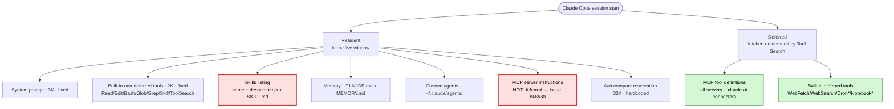
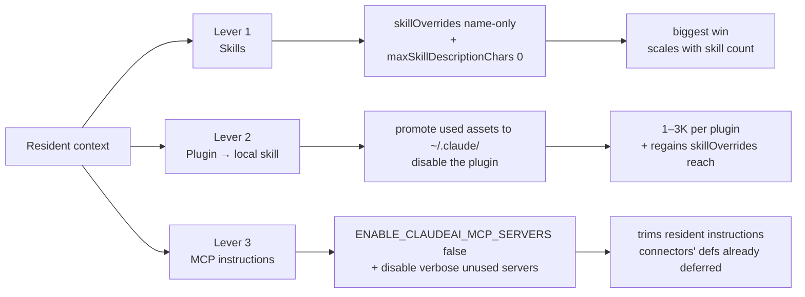
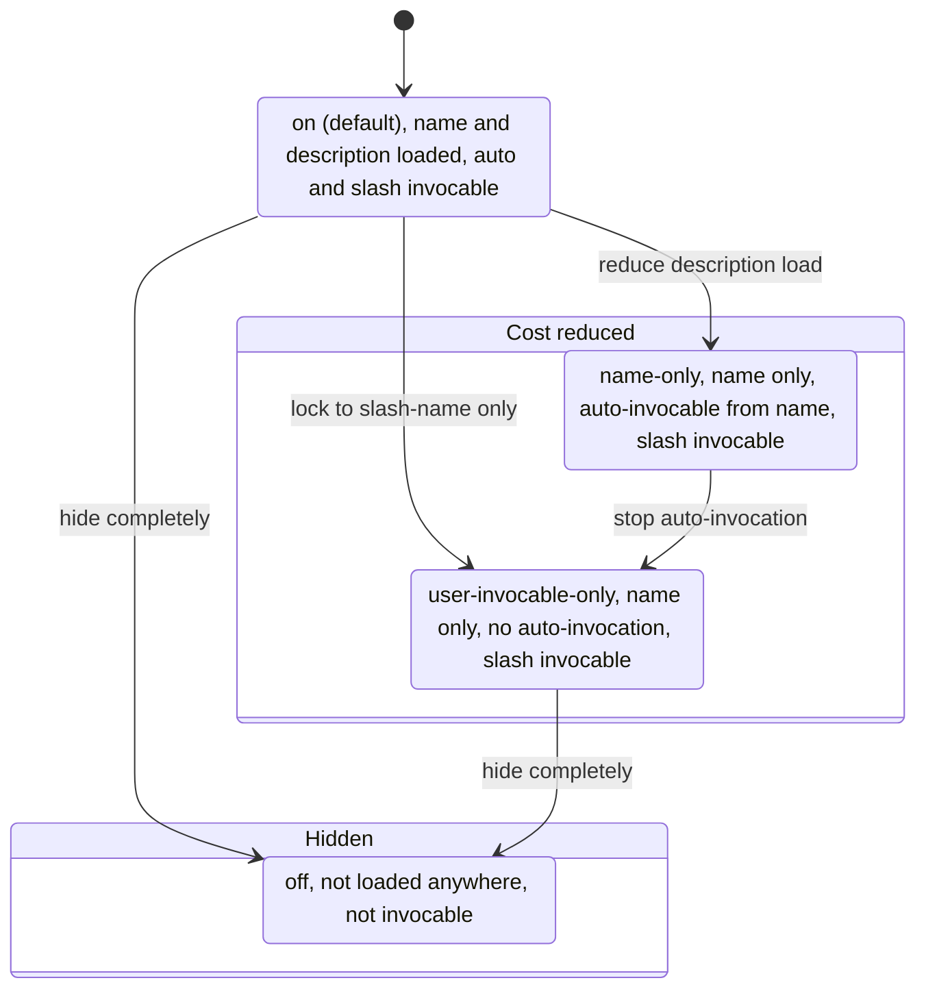
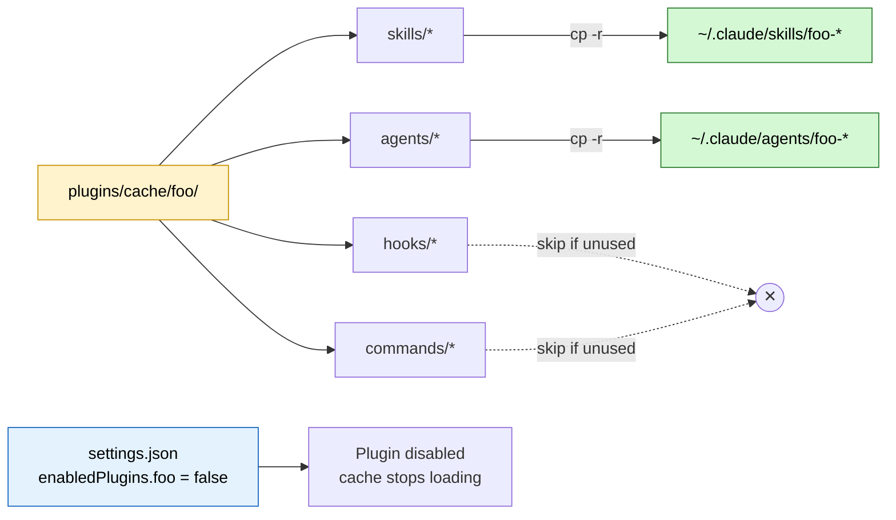
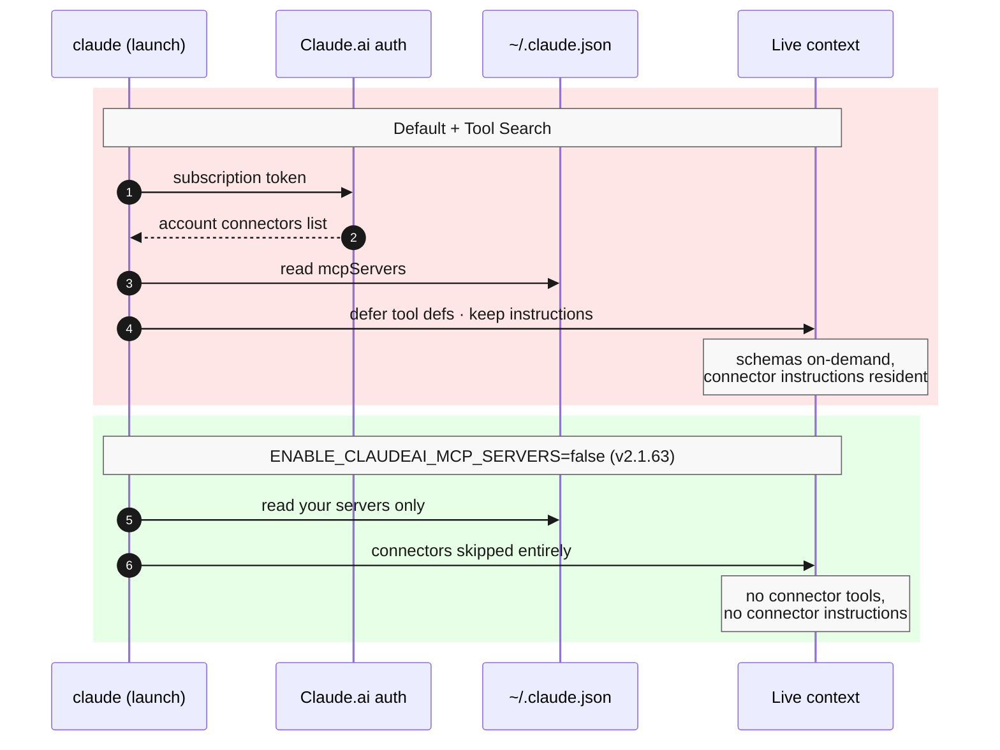
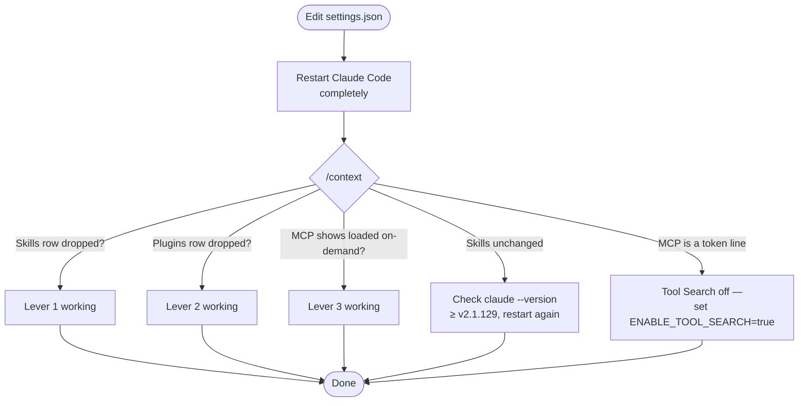

import { ArticleLayout } from '@/components/ArticleLayout'

export const article = {
  author: 'Ryota Murakami',
  title:
    "Cutting Claude Code's Initial Context Bloat — Skills, Plugins, and MCP Tactics",
  date: '2026-05-21',
  description:
    'What Claude Code actually loads into context at startup once Tool Search defers MCP and built-in tool definitions on demand — why the live window is far smaller than the raw totals imply, and why Skills (not MCP) is now the biggest line you can cut, plus the plugin and MCP-instruction levers that trim the rest.',
}

export default (props) => <ArticleLayout article={article} {...props} />

## The Problem in One `/context`

Open a fresh Claude Code session, type "hi", and run `/context`. On a heavy power-user config (22+ MCP servers, 150+ skills, half a dozen plugins) the live window looks like this:

```
Context Usage — Opus 4.7
16.8k / 200k tokens (8%)

Estimated usage by category
- System prompt:        2.8k   (1.4%)
- System tools:         2k     (1.0%)
- Custom agents:        1.4k   (0.7%)
- Memory files:         2.2k   (1.1%)
- Skills:               8.3k   (4.2%)   ← biggest controllable line
- Messages:             13 tokens
- Free space:           150.2k (75.1%)
- Autocompact buffer:   33k    (16.5%)  ← reserved, hardcoded

MCP tools · /mcp (loaded on-demand)      ← NOT counted above
```

Only ~16.8K is actually resident before you type — and most of that is fixed: the system prompt, the built-in non-deferred tools, and the 33K autocompact reservation you can't reclaim. The 22+ MCP servers and the built-in deferred tools contribute **zero** to that live number. Tool Search lists their _names_ and fetches each schema on demand, so they live in a separate "loaded on-demand" bucket — not in the window.

The single largest line you can actually move is **Skills**.

> **Correction (May 2026).** An earlier cut of this article led with `MCP tools (deferred): 67.6k ← biggest culprit` and claimed ~66K was "gone before the conversation begins." That was a misread of `/context`: the deferred figure is what's _available to fetch_, not what's _resident_. (The giveaway: the old snapshot listed a 67.6K "deferred" line under a 33.8K total — a part can't exceed its whole, because it was never part of the live total.) With Tool Search on — the default for any modern setup — MCP and built-in tool **definitions** are deferred and never enter the live window. The number you can actually cut is far smaller, and it is dominated by Skills, not MCP. The rest of this article reflects that corrected model. (A second blind spot — `/context` has no bucket for MCP server instructions — is unpacked further down.)

---

## Resident vs. Deferred — What Actually Loads

The startup payload is a fixed system prompt plus several **dynamically discovered** resources. The detail the old framing missed: Tool Search splits that payload into two buckets. The official MCP docs put it plainly — _"Tool search is enabled by default. MCP tools are deferred rather than loaded into context upfront."_

- **Resident** — counts against your live window the moment the session opens.
- **Deferred** — discovered and listed by name, but the full definition is fetched on demand. It does **not** count against the live window.



The red nodes are the resident costs worth attacking: the **Skills listing** and **MCP server instructions**. The green nodes — MCP tool definitions (including the big claude.ai connector catalogs) and the built-in deferred tools — are already off your books thanks to Tool Search. Everything else is fixed (system prompt, built-in tools, autocompact buffer) or marginal (memory, agents).

### Where the official sources describe each loader

| Loader                  | Behaviour                                                                                                                                                                                                                               | Source                                                                                                                                                                                                                                 |
| ----------------------- | --------------------------------------------------------------------------------------------------------------------------------------------------------------------------------------------------------------------------------------- | -------------------------------------------------------------------------------------------------------------------------------------------------------------------------------------------------------------------------------------- |
| Tool Search             | Defers tool **definitions** (MCP + built-in) and fetches them on demand, so they leave the live window — this is why the resident total is small                                                                                        | [Claude Code MCP docs](https://code.claude.com/docs/en/mcp), [Tool Search SDK](https://code.claude.com/docs/en/agent-sdk/tool-search), [API reference](https://platform.claude.com/docs/en/agents-and-tools/tool-use/tool-search-tool) |
| MCP tool definitions    | Deferred by Tool Search like any other tool: names listed, schema fetched on demand                                                                                                                                                     | [Claude Code MCP docs](https://code.claude.com/docs/en/mcp)                                                                                                                                                                            |
| MCP server instructions | Each connected server contributes an _instructions string_ — resident, not deferred, capped at 2KB per server. The next section unpacks the mechanism and how to measure it.                                                              | [Claude Code MCP docs](https://code.claude.com/docs/en/mcp), [Issue #48680](https://github.com/anthropics/claude-code/issues/48680)                                                                                                     |
| claude.ai connectors    | Pro/Max sign-in makes account connectors (Gmail, Linear, Notion…) available; their tool defs defer like everything else, leaving only the ≤2KB instructions resident — disable them in the CLI with `ENABLE_CLAUDEAI_MCP_SERVERS=false` | [Claude Code MCP docs](https://code.claude.com/docs/en/mcp), [Issue #50062](https://github.com/anthropics/claude-code/issues/50062)                                                                                                    |
| Skills                  | Each `SKILL.md` frontmatter (`name` + `description`) is concatenated into a listing that ships **resident** in the system prompt — the biggest controllable line                                                                        | [Claude Code Skills](https://code.claude.com/docs/en/skills), [agentskills.io spec](https://agentskills.io/client-implementation/adding-skills-support)                                                                                |
| Skill discovery paths   | Four locations are scanned: `~/.<client>/skills/`, `~/.agents/skills/`, and project-level equivalents                                                                                                                                   | [Agent Skills client implementation](https://agentskills.io/client-implementation/adding-skills-support#where-to-scan)                                                                                                                 |
| Plugins                 | Marketplace plugins drop hooks, agents, skills, and commands into `plugins/cache/`; **plugin skills are not controllable via `skillOverrides`**                                                                                         | [Plugin docs](https://code.claude.com/docs/en/plugins), [Skills override note](https://code.claude.com/docs/en/skills)                                                                                                                 |
| Autocompact buffer      | A 33K reservation at the top of the window; environment overrides only shift the _trigger threshold_, not the reservation size                                                                                                          | [Issue #12053](https://github.com/anthropics/claude-code/issues/12053), [Issue #31806](https://github.com/anthropics/claude-code/issues/31806)                                                                                         |

Two community write-ups did most of the early legwork: Scott Spence's [Optimising MCP Server Context Usage](https://scottspence.com/posts/optimising-mcp-server-context-usage-in-claude-code) and atcyrus's [MCP Tool Search Context Pollution Guide](https://www.atcyrus.com/stories/mcp-tool-search-claude-code-context-pollution-guide). Note the era: their dramatic before/after numbers describe a moment when Tool Search wasn't yet doing the deferral for you. The mechanism they document still matters — but today it pays back against the residual _instructions_ cost, not a 60K wall of tool schemas. And that residual cost is more elusive than it looks — `/context` itself doesn't have a line for it.

---

## Why MCP instructions don't show up in `/context`

If you ran `/context` on a session with 20+ MCP servers and went looking for the instructions cost, you didn't find a line. That's not your eyes — `/context` itself has no category for them. It rebuilds the printout from a fixed taxonomy of eight buckets (`System prompt`, `System tools`, `MCP tools`, `MCP tools (deferred)`, `Custom agents`, `Memory files`, `Skills`, `Messages`) and pushes each as a named row. There is no "MCP instructions" row, and there never has been.

Where do they actually live? At session start Claude Code emits each connected server's instructions string as a single `# MCP Server Instructions` block — visible inline in your transcript as a `<system-reminder>` — through an internal `mcp_instructions_delta` channel (names verified in v2.1.153 bundle internals). The block is delivered as a message attachment, not as part of the static system prompt, and it is flagged `isMeta: true`. The two counters that should have caught it both skip it:

- The "System prompt" bucket counts only the static system-prompt sections — message-stream attachments fall through.
- The "Messages" counter explicitly skips `isMeta` blocks.

That is the measurement gap. Before the first real turn runs, the `/context` headline is the sum of the visible buckets — and because neither bucket counts MCP instructions, the headline _understates_ the live context by exactly that amount. After the first real turn the headline switches to the API's actual token usage (input + cache reads) and silently absorbs them — still no itemized line.

So you measure them yourself:

| Want                            | How                                                                                                                                                                                                              |
| ------------------------------- | ---------------------------------------------------------------------------------------------------------------------------------------------------------------------------------------------------------------- |
| The raw instructions text       | Open the session JSONL at `~/.claude/projects/<encoded-cwd>/<session-id>.jsonl` and find the attachment whose body starts with `# MCP Server Instructions`                                                       |
| The real resident cost (delta)  | Run `/context` after one real turn with the servers connected, then again with them disabled (`ENABLE_CLAUDEAI_MCP_SERVERS=false` for connectors, or remove from `.mcp.json`); the headline delta is the cost   |
| The cost of a single payload    | Paste the text from the JSONL into `/v1/messages/count_tokens` as a `system` block — the same endpoint Claude Code uses internally for `/context`'s itemized rows                                                |
| The upper bound                 | Each server's instructions string is truncated at 2048 UTF-16 characters; total resident ≤ N × 2KB                                                                                                                |

Both findings — the eight-bucket taxonomy and the `isMeta`-skip — are verifiable in the v2.1.153 bundle: `strings ~/.local/share/claude/versions/2.1.153 | grep -E 'mcp_instructions_delta|getMcpInstructionsDeltaAttachment'` returns the channel name and the getter that does the injection.

---

## The Three Levers



Each lever attacks a **resident** discovery path — something the loader keeps in the live window before your first prompt is processed. They are ordered by payback: Skills first because it is now the largest controllable line, MCP last because Tool Search already did most of that job for you.

---

## Lever 1 · Skills — `skillOverrides` Done Right

### What lives in the Skills bucket

Every `SKILL.md` discovered at startup contributes a `name` (a few tokens) and a `description` (up to `maxSkillDescriptionChars`, default **1536**) to the system prompt's skill listing. This is **resident** — it does not defer. A user with 150 skills at full descriptions can burn well past 15K tokens here; the 8.3K in my `/context` above is already the _post-optimization_ figure. This is the line you move first.

### The four states (corrected May 2026)

`skillOverrides` is a **per-skill object** keyed by directory name. A previously published recommendation in one of my own research notes used a _string_ form (`"skillOverrides": "user-invocable-only"`) — that form **fails JSON schema validation**; the object form is the only one supported.

The state diagram below maps the four legal values and the transitions that progressively reduce cost: the default `on` state, two cost-reduced states (`name-only` keeps auto-invocation; `user-invocable-only` requires explicit slash invocation), and the fully hidden `off` state.



The pivotal difference between the two cost-reduced values is **auto-invocation**. `user-invocable-only` truly does only what its name says — the skill is reachable through `/skill-name`. Auto-invocation is off, so the model won't reach for the skill on its own when the task naturally calls for it. `name-only` keeps the name in the listing and leaves auto-invocation alive, so the model can decide to load and run the skill on its own when the task calls for it.

That distinction is why I picked `name-only` for everything. A lot of my flow is `/goal "do X"`-style natural-language direction where the model (or a subagent it spawns) needs to recognize "ah, the _qa-team_ skill fits this" and load it without me typing the slash command. `user-invocable-only` would kill that and force me to remember and type every skill name. I keep `user-invocable-only` in reserve for the rare skill I want gated behind explicit invocation, but in practice that bucket is empty for me right now.

### Setup

```bash
# Apply name-only to every locally-discoverable skill
SKILLS=$(find ~/.claude/skills ~/.agents/skills -maxdepth 2 -name "SKILL.md" 2>/dev/null \
  | sed 's|.*/skills/||; s|/SKILL.md$||' | sort -u)

OVERRIDES=$(echo "$SKILLS" | jq -R . | jq -s 'map({(.): "name-only"}) | add')

jq --argjson o "$OVERRIDES" '
  .skillOverrides = $o |
  .maxSkillDescriptionChars = 0 |
  .skillListingBudgetFraction = 0.005
' ~/.claude/settings.json > /tmp/s.json && mv /tmp/s.json ~/.claude/settings.json
```

Three settings, three purposes:

| Setting                      | Default | My value                         | Why                                                                                                       |
| ---------------------------- | ------- | -------------------------------- | --------------------------------------------------------------------------------------------------------- |
| `skillOverrides`             | `{}`    | `{ <every-skill>: "name-only" }` | Drop descriptions, keep auto/subagent invocation                                                          |
| `maxSkillDescriptionChars`   | `1536`  | `0`                              | Drops descriptions entirely — only names remain, a hard safety net against any skill I forget to override |
| `skillListingBudgetFraction` | `0.01`  | `0.005`                          | Hard ceiling on how much of the window the skill listing can consume                                      |

Restart Claude Code completely after editing — the skill listing is cached for the current session. Verify with `/context` and look at the `Skills` row.

### Caveats

- **Plugin skills are not affected by `skillOverrides`.** That is the whole reason Lever 2 exists.
- **Build version matters.** `skillOverrides` was broken until v2.1.129 — in earlier builds it was a stub that always returned `on` ([Issue #50631](https://github.com/anthropics/claude-code/issues/50631)). Confirm with `claude --version`. (Whether `skillOverrides` also reaches _built-in_ skills is unsettled; the request to let you disable those, [Issue #26838](https://github.com/anthropics/claude-code/issues/26838), was closed as a duplicate.)
- The frontmatter equivalents `disable-model-invocation: true` and `user-invocable: false` work too, but `skillOverrides` is faster to bulk-apply.

---

## Lever 2 · Plugin → Local Skill

Marketplace plugins are convenient but they ship a bundle: hooks, agents, skills, and commands all enabled together. The skills they include sit in `~/.claude/plugins/cache/.../skills/` and — per the official docs — **cannot be silenced by `skillOverrides`**. So if a plugin contributes five chatty skills that you never auto-invoke, those five descriptions are loaded resident every session no matter what.

The workaround is to **promote the parts you actually use into user space**, then disable the plugin.



### Steps

1. **Identify what the plugin contributes.** Each plugin's cache directory mirrors `skills/`, `agents/`, `hooks/`, `commands/` from its source.

   ```bash
   ls ~/.claude/plugins/cache/<plugin>@<marketplace>/
   ```

2. **Copy only what you use into user space.**

   ```bash
   cp -r ~/.claude/plugins/cache/codex@openai-codex/skills/codex-cli-runtime \
         ~/.claude/skills/

   cp -r ~/.claude/plugins/cache/coderabbit@claude-plugins-official/agents/code-reviewer \
         ~/.claude/agents/
   ```

3. **Disable the plugin.** Either remove its key from `enabledPlugins` in `~/.claude/settings.json` or run `claude plugin uninstall <plugin>@<marketplace>`.

4. **Add the now-local skills to `skillOverrides`.** They are user skills now, so Lever 1 applies. `name-only` or `user-invocable-only` as appropriate.

5. **When the plugin updates**, you have to re-copy. The tradeoff is conscious: you trade automatic updates for `skillOverrides` control and lower steady-state context cost. For plugins you use rarely, the trade is worth it.

### What I localized recently

| Plugin                                         | Kept                                                                                             | Disabled         | Tokens reclaimed                             |
| ---------------------------------------------- | ------------------------------------------------------------------------------------------------ | ---------------- | -------------------------------------------- |
| `codex@openai-codex`                           | `codex-rescue` agent, `codex-cli-runtime` / `codex-result-handling` / `gpt-5-4-prompting` skills | yes              | ~1.4K (plus regained `skillOverrides` reach) |
| `coderabbit@claude-plugins-official`           | `code-reviewer` agent, `autofix` / `code-review` skills                                          | yes              | ~1K                                          |
| `figma@claude-plugins-official`                | nothing globally — enabled only inside the `zumen-fe` project via `.claude/settings.local.json`  | yes (user-level) | ~1.4K                                        |
| `claude-md-management@claude-plugins-official` | nothing — I never used it                                                                        | yes              | small                                        |

The figma case demonstrates a fourth pattern worth mentioning: **scope a plugin to one project**. Disable it at user level, then re-enable in a single project's `.claude/settings.local.json`:

```json
{ "enabledPlugins": { "figma@claude-plugins-official": true } }
```

The plugin loads only when you `cd` into that project.

---

## Lever 3 · MCP — Trim What Tool Search Can't Defer

Here is the lever the old version of this article got backwards. In current Claude Code, **MCP tool definitions are deferred by Tool Search** — they do not sit in your live window. The official docs are explicit: _"Tool search is enabled by default. MCP tools are deferred rather than loaded into context upfront."_ The old advice to "block the claude.ai connectors to save ~100K" described a real pre-deferral era ([Issue #50062](https://github.com/anthropics/claude-code/issues/50062), now closed as completed) — but today those connector tool definitions defer like everything else. Two genuinely resident costs remain:

1. **MCP server instructions.** Every connected server can ship an _instructions string_ that tells the model when to reach for it — the residual cost the measurement-gap section quantifies. Not deferred ([Issue #48680](https://github.com/anthropics/claude-code/issues/48680)), capped at 2KB per server ([Claude Code MCP docs](https://code.claude.com/docs/en/mcp)). Verbose servers (Serena's operating guide, DeepWiki's tool catalog) spend that whole budget on every session.
2. **Setups that don't defer at all.** Tool Search is off by default on Vertex AI and when `ANTHROPIC_BASE_URL` points at a non-first-party proxy, and `ENABLE_TOOL_SEARCH=false` puts _every_ definition back in the window. (An earlier report that HTTP/Streamable tools didn't defer at all, [Issue #40314](https://github.com/anthropics/claude-code/issues/40314), was closed as _not-planned_; current docs confirm HTTP tools defer like any other.)

So this lever is now narrow: disable servers whose instructions you don't need, and — if you sign in with a subscription — keep the claude.ai connectors out of the CLI.

### Disabling claude.ai connectors (the primary lever)

The connectors arrive through your subscription, not through `claude mcp add`. You add them on the web at [claude.ai/customize/connectors](https://claude.ai/customize/connectors) (Gmail, Linear, Notion, Google Drive, Google Calendar, Exa, Figma…; on Team and Enterprise plans only admins can add them), and once you've signed into Claude Code with that same Claude.ai account they become **automatically available** — no per-machine `claude mcp add` step. They sit _last_ in the [MCP config precedence](https://code.claude.com/docs/en/mcp) (after local, project, user, and plugin servers), are matched against your own servers by endpoint, and show up in `/mcp` flagged as coming from Claude.ai. They're fetched _only_ while your active auth is the Claude.ai subscription — never under `ANTHROPIC_API_KEY`, `ANTHROPIC_AUTH_TOKEN`, Bedrock, or Vertex.

With Tool Search their tool _definitions_ defer, but their instructions and name listing still ride along resident. Since **v2.1.63** there is a documented first-party switch that drops them from the CLI entirely — set it to `false`:

```bash
ENABLE_CLAUDEAI_MCP_SERVERS=false claude
```

Put it in your `settings.json` `env` block (see below) to make it permanent. This is the switch the canonical opt-out request [#50062](https://github.com/anthropics/claude-code/issues/50062) tracked — it closed as **completed** when the env var shipped. The parallel toggle requests [#44112](https://github.com/anthropics/claude-code/issues/44112), [#47881](https://github.com/anthropics/claude-code/issues/47881), and [#56773](https://github.com/anthropics/claude-code/issues/56773) were all closed as **not-planned**; [#20412](https://github.com/anthropics/claude-code/issues/20412) stays **open** for the broader "auto-injection can OOM constrained machines" concern. The connectors stay available on claude.ai and Claude Desktop; only Claude Code ignores them.

The contrast in one diagram — default behaviour keeps connector instructions resident; `ENABLE_CLAUDEAI_MCP_SERVERS=false` skips the connectors entirely:



> **Legacy note · `--strict-mcp-config`.** Before v2.1.63 the only way to keep connectors out was to launch with `--strict-mcp-config --mcp-config <your-file>`, which loads _only_ a hand-picked server file and ignores _every_ other MCP source — connectors and any local server you didn't list. `ENABLE_CLAUDEAI_MCP_SERVERS=false` makes that unnecessary for cutting connectors; reach for `--strict-mcp-config` now only if you also want to pin the CLI to one explicit server file (`claude --help`: _"Only use MCP servers from `--mcp-config`, ignoring all other MCP configurations."_).

### Why there's no instruction-level toggle

The connector switch above drops instructions as a side effect of disconnecting the server — Claude Code never opens the connection, so no `initialize` response arrives and nothing is injected. There is no equivalent first-party switch that keeps a server's tools while dropping just its instructions. The bundle (v2.1.153) confirms the gap: the assembly function that builds the resident block is unconditional. As long as a connected server's MCP `initialize` result has a non-empty `instructions` field, the string is appended. No env var, setting, or flag is consulted on the way through.

The omission is conspicuous because sibling features got the toggle. Skills have a per-turn `suppressNextSkillListing` flag for eliding the listing, and git-related guidance has the `CLAUDE_CODE_DISABLE_GIT_INSTRUCTIONS` env var for skipping the whole block. MCP server instructions never received an equivalent; [#48680](https://github.com/anthropics/claude-code/issues/48680) is open against the resulting cost but is framed around deferral, not a suppress toggle.

If you can't live with a verbose server's instructions but still want its tools, the only door is **server-side**: edit the server's `initialize` response to omit `instructions`. For a server you don't own, a small MCP proxy that rewrites the response on the way through is the only mechanical option — undocumented and unsupported, so treat it as load-bearing only if you control both ends.

### What does _not_ cut instruction cost

| Setting / behavior                                | Why it doesn't help                                                                                                                                  |
| ------------------------------------------------- | ---------------------------------------------------------------------------------------------------------------------------------------------------- |
| `ENABLE_TOOL_SEARCH=true` (default)               | Defers tool _schemas_ only — the instructions channel is decoupled and unaffected                                                                    |
| The 2KB-per-server cap                            | Bounds the damage; doesn't remove it. `N` servers can spend up to `N × 2KB` resident                                                                |
| `permissions.deny` on a server's tools            | Blocks tool **calls**; the instructions were already injected at connect time                                                                        |
| `--mcp-config <file>` alone                       | Additive — appends to whatever the default sources already loaded. Pair with `--strict-mcp-config` to scope                                          |
| Transport / `alwaysLoad` / plugin-bundled servers | None of these change whether the `initialize` instructions are injected                                                                              |

### Keep Tool Search on

This entire lever assumes Tool Search is doing the deferral — and it is on by default. But if `ENABLE_TOOL_SEARCH` gets set to `false`, or `auto` mode fails to engage above its threshold ([Issue #18370](https://github.com/anthropics/claude-code/issues/18370)), every MCP tool definition snaps back into the live window and you're staring at the old 60K wall. Set it to `true` explicitly (see the settings block below) and confirm with `/context` that the MCP servers show under "loaded on-demand," not as a token line.

---

## My Current `settings.json` (Reduced Form)

```json
{
  "$schema": "https://json.schemastore.org/claude-code-settings.json",
  "env": {
    "ENABLE_TOOL_SEARCH": "true",
    "ENABLE_CLAUDEAI_MCP_SERVERS": "false",
    "CLAUDE_CODE_ENABLE_TELEMETRY": "0",
    "MAX_MCP_OUTPUT_TOKENS": "200000",
    "CLAUDE_CODE_EXPERIMENTAL_AGENT_TEAMS": "1",
    "CLAUDE_CODE_DISABLE_1M_CONTEXT": "1",
    "CLAUDE_CODE_EFFORT_LEVEL": "max"
  },
  "skillOverrides": {
    "<every-skill-name>": "name-only"
  },
  "maxSkillDescriptionChars": 0,
  "skillListingBudgetFraction": 0.005,
  "enabledPlugins": {
    "figma@claude-plugins-official": false,
    "codex@openai-codex": false,
    "coderabbit@claude-plugins-official": false,
    "claude-md-management@claude-plugins-official": false
  }
}
```

Two env vars carry this setup. `ENABLE_TOOL_SEARCH: "true"` is the linchpin — it's what defers the MCP and built-in tool definitions out of the live window. `ENABLE_CLAUDEAI_MCP_SERVERS: "false"` keeps the subscription connectors out of the CLI. Add the `--strict-mcp-config` flag (the legacy note in Lever 3) only if you want to pin the CLI to one explicit server file as well.

---

## Verification



Concretely:

```bash
# 1. inspect the context split — MCP should be "loaded on-demand", not a token line
/context

# 2. if the Skills row is still large
claude --version   # must be ≥ v2.1.129
jq '.skillOverrides | length' ~/.claude/settings.json   # should match skill count

# 3. confirm the claude.ai connectors are gone and only your servers remain
/mcp

# 4. confirm plugins are off
jq '.enabledPlugins' ~/.claude/settings.json
```

---

## Known Bugs to Watch

| Issue                                                                                                                                                                                                                                                                                 | Status            | Why it matters                                                                                                                                                                                                        |
| ------------------------------------------------------------------------------------------------------------------------------------------------------------------------------------------------------------------------------------------------------------------------------------- | ----------------- | --------------------------------------------------------------------------------------------------------------------------------------------------------------------------------------------------------------------- |
| [#48680](https://github.com/anthropics/claude-code/issues/48680)                                                                                                                                                                                                                      | OPEN              | MCP **server instructions** are not Tool Search-deferred — the residual cost the measurement-gap section quantifies and Lever 3 targets. **No first-party suppress toggle**; see _Why there's no instruction-level toggle_ in Lever 3. |
| [#40314](https://github.com/anthropics/claude-code/issues/40314) | CLOSED · not-planned | Reported that HTTP/Streamable MCP tools didn't defer (120K upfront); closed as not-planned, and current docs confirm HTTP tools defer under Tool Search — verify on your transport with `/mcp` and `/context` |
| [#54716](https://github.com/anthropics/claude-code/issues/54716)                                                                                                                                                                                                                      | OPEN              | Built-in deferred tools have no opt-out yet — harmless while they stay deferred, but worth tracking                                                                                                                   |
| [#41809](https://github.com/anthropics/claude-code/issues/41809) | CLOSED · not-planned | Disabled MCP servers used to remain in the deferred list — verify after disabling |
| [#12053](https://github.com/anthropics/claude-code/issues/12053), [#31806](https://github.com/anthropics/claude-code/issues/31806) | CLOSED · not-planned / duplicate | Autocompact buffer (~33K) is hardcoded; `CLAUDE_AUTOCOMPACT_PCT_OVERRIDE` shifts the trigger threshold but cannot free the reservation or raise the threshold above the default |
| [#50631](https://github.com/anthropics/claude-code/issues/50631)                                                                                                                                                                                                                      | FIXED in v2.1.129 | `skillOverrides` was a no-op (a stub that always returned `on`) in earlier builds — make sure you upgraded before measuring                                                                                           |
| [#50062](https://github.com/anthropics/claude-code/issues/50062) COMPLETED · [#44112](https://github.com/anthropics/claude-code/issues/44112) / [#47881](https://github.com/anthropics/claude-code/issues/47881) / [#56773](https://github.com/anthropics/claude-code/issues/56773) not-planned · [#20412](https://github.com/anthropics/claude-code/issues/20412) OPEN | mixed | The per-client connector toggle shipped as `ENABLE_CLAUDEAI_MCP_SERVERS=false` (v2.1.63): canonical request #50062 closed as completed, the duplicate toggle requests closed as not-planned, and #20412 stays open for the OOM-on-constrained-machines angle |
| [#18370](https://github.com/anthropics/claude-code/issues/18370)                                                                                                                                                                                                                      | OPEN              | Tool Search `auto` mode sometimes fails to engage above its threshold — set `ENABLE_TOOL_SEARCH=true` explicitly or the deferral silently stops                                                                       |

The deeper takeaway: deferral is the load-bearing architecture, and it works. Most of what's left are _leak paths_ around it — instructions that don't defer, a mode that occasionally fails to engage. The fix is not "turn deferral off"; it's making sure deferral has nothing left to leak around, and trimming the handful of things it was never designed to cover. That is exactly what the three levers accomplish.

---

## What Did Not Make the Cut

A few options I considered and rejected:

- **Switching to `ANTHROPIC_API_KEY` auth.** API-key (and Bedrock/Vertex) sessions never fetch the claude.ai connectors at all. But you don't need to change auth to get that: `ENABLE_CLAUDEAI_MCP_SERVERS=false` drops the connectors without touching your Max plan billing.
- **Editing `cachedGrowthBookFeatures.tengu_claudeai_mcp_connectors` in `~/.claude.json`.** The server overwrites it on the next handshake — see [#44112](https://github.com/anthropics/claude-code/issues/44112). Use the documented env var instead.
- **Setting every skill to `off`.** Tempting for a clean `/context` printout, but you lose all auto-discovery; you have to remember every skill name. `name-only` is a kinder default.
- **Disabling autocompact.** It is structurally hardcoded; the only knob is `CLAUDE_AUTOCOMPACT_PCT_OVERRIDE`, which delays the trigger but does not free the reservation.

---

## References

### Official docs

- [Claude Code Settings](https://code.claude.com/docs/en/settings)
- [Claude Code MCP](https://code.claude.com/docs/en/mcp)
- [Claude Code Skills](https://code.claude.com/docs/en/skills)
- [Claude Code Plugins](https://code.claude.com/docs/en/plugins)
- [Claude Code Changelog](https://code.claude.com/docs/en/changelog)
- [Agent SDK · Tool Search](https://code.claude.com/docs/en/agent-sdk/tool-search)
- [Tool Search API reference](https://platform.claude.com/docs/en/agents-and-tools/tool-use/tool-search-tool)
- [Agent Skills spec — discovery paths](https://agentskills.io/client-implementation/adding-skills-support#where-to-scan)
- [Anthropic Engineering — Advanced tool use](https://www.anthropic.com/engineering/advanced-tool-use)

### Community write-ups that informed this article

- Scott Spence — [Optimising MCP Server Context Usage in Claude Code](https://scottspence.com/posts/optimising-mcp-server-context-usage-in-claude-code)
- atcyrus — [MCP Tool Search Context Pollution Guide](https://www.atcyrus.com/stories/mcp-tool-search-claude-code-context-pollution-guide)
- Paddo — [MCP Context Isolation via Slash Commands](https://paddo.dev/blog/claude-code-mcp-context-isolation/)
- candede — [Solving MCP Context Bloat](https://www.candede.com/articles/claude-tool-search)
- Joe Njenga — [Cutting MCP context bloat with Tool Search](https://medium.com/@joe.njenga/claude-code-just-cut-mcp-context-bloat-by-46-9-51k-tokens-down-to-8-5k-with-new-tool-search-ddf9e905f734)

### Tools mentioned

- [agent skills CLI](https://agentskills.io) — `npx skills` for cross-client skill installation

If you go through the exercise and end up with a different cost distribution, I would genuinely like to hear about it — the leak paths shift with every Claude Code release, and the next 6 months of changelog entries will likely change which lever pays back the most.
