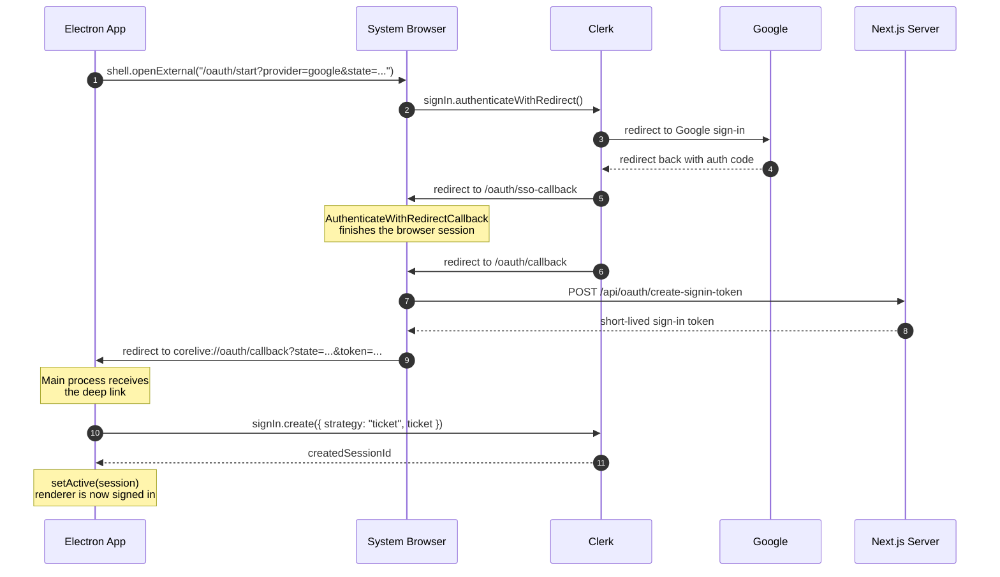

import { ArticleLayout } from '@/components/ArticleLayout'

export const article = {
  author: 'Ryota Murakami',
  title: 'Electron Google OAuth with Next.js 16 App Router and Clerk v7',
  date: '2026-04-08',
  description:
    'A practical guide to implementing Google OAuth for Electron using Next.js 16 App Router, Clerk v7, a system browser, deep links, and short-lived sign-in tokens.',
}

export default (props) => <ArticleLayout article={article} {...props} />

Google OAuth inside Electron sounds straightforward until you try to ship it.

In a normal web app, Clerk can complete the whole flow in the browser and keep the session in cookies. In an Electron app, that assumption breaks quickly:

- Google blocks embedded browser sign-in with `403: disallowed_useragent`
- The system browser session and the Electron renderer session are different cookie jars
- Many examples stop at `authenticateWithRedirect()` and do not cover the desktop handoff step

After a lot of trial and error, I ended up with a flow that works reliably in production with **Next.js 16 App Router**, **Electron**, and **Clerk v7**.

This post explains the implementation and the pitfalls that actually mattered.

---

## The Working Flow

The architecture that worked for me is a **system browser + deep link handoff**.



That is the key idea:

- **Do OAuth in the system browser**
- **Create a short-lived sign-in token on the server**
- **Return to Electron via deep link**
- **Create a fresh renderer session from that token**

You are not “sharing” the browser session with Electron. You are **bridging** it.

---

## Why You Cannot Just Use Google OAuth in Electron Directly

If you open Google sign-in inside an Electron `BrowserWindow` or `webview`, you will eventually run into:

```text
403: disallowed_useragent
```

This is not a Clerk bug. It is the provider rejecting an embedded browser flow.

That is why the correct mental model is:

- The Electron app starts the flow
- The real browser performs the sensitive OAuth steps
- The browser returns to the app through a custom protocol such as `corelive://`

If you are wondering what this pattern is called, “**system browser OAuth with deep link callback**” is probably the clearest name.

---

## Route Structure in Next.js App Router

In my case, I ended up with four dedicated routes:

| Route                           | Purpose |
| ------------------------------- | ------- |
| `/oauth/start`                  | Starts Clerk OAuth in the system browser |
| `/oauth/sso-callback`           | Hosts Clerk's `<AuthenticateWithRedirectCallback />` |
| `/oauth/callback`               | Creates a one-time sign-in token and redirects to Electron |
| `/api/oauth/create-signin-token` | Server route that mints the short-lived Clerk sign-in token |

Keeping these responsibilities separate made the flow much easier to debug.

---

## 1. Start OAuth in the System Browser from Electron

On the Electron side, I generate a `state` value, build the OAuth start URL, and open it with `shell.openExternal()`.

```ts
const state = crypto.randomBytes(32).toString('hex')

const oauthUrl =
  `${getWebAppOrigin()}/oauth/start?provider=google&state=${state}`

await shell.openExternal(oauthUrl)
```

One important detail: **derive the web app origin from the current BrowserWindow URL**.

That matters because in development you might be loading `http://localhost:3011`, while in production you load `https://corelive.app`.

If Electron opens the wrong origin, you can accidentally create OAuth state on one Clerk instance and try to consume the result on another.

That leads to very confusing errors such as:

- invalid ticket
- missing session
- deep link comes back but Electron still cannot sign in

This was one of the most important fixes in my implementation.

---

## 2. Start Clerk OAuth on `/oauth/start`

The browser entry page is a client component that calls `signIn.authenticateWithRedirect()`.

```tsx
await signIn.authenticateWithRedirect({
  strategy: 'oauth_google',
  redirectUrl: `/oauth/sso-callback?state=${encodeURIComponent(state)}`,
  redirectUrlComplete: `/oauth/callback?state=${encodeURIComponent(state)}`,
})
```

This distinction is critical:

- `redirectUrl` is **not** your final destination
- `redirectUrl` should point to the route that runs Clerk's redirect callback logic
- `redirectUrlComplete` is where you continue *after Clerk has finalized the browser session*

If you skip that separation and try to jump directly from Google back into your own bridge page, the flow becomes fragile.

In my app, `/oauth/start` also handles the case where the browser already has an active Clerk session:

```tsx
if (isUserLoaded && user) {
  window.location.replace(`/oauth/callback?state=${encodeURIComponent(state)}`)
  return
}
```

That matters because otherwise Clerk may throw:

```text
You're already signed in.
```

When that happens, the best behavior is usually to skip restarting OAuth and go straight to the bridge page.

---

## 3. Let Clerk Finish the Browser Session on `/oauth/sso-callback`

The callback route should stay very thin.

In App Router, I simply mounted Clerk's callback component:

```tsx
<AuthenticateWithRedirectCallback
  signInForceRedirectUrl={`/oauth/callback?state=${encodeURIComponent(state ?? '')}`}
  signUpForceRedirectUrl={`/oauth/callback?state=${encodeURIComponent(state ?? '')}`}
/>
```

This route exists only to let Clerk finish the browser-side sign-in correctly.

This was another easy place to make mistakes. I had much better results when I treated `/oauth/sso-callback` as a Clerk-owned transition point and kept my own application logic in `/oauth/callback`.

---

## 4. Create a Short-Lived Sign-In Token on the Server

Once Clerk has an authenticated browser session, the next step is to mint a short-lived token that Electron can consume.

My server route looks like this:

```ts
import { auth, clerkClient } from '@clerk/nextjs/server'
import { NextResponse } from 'next/server'

export async function POST() {
  const { userId } = await auth()

  if (!userId) {
    return NextResponse.json(
      { error: 'Not authenticated. Please sign in first.' },
      { status: 401 },
    )
  }

  const client = await clerkClient()
  const signInToken = await client.signInTokens.createSignInToken({
    userId,
    expiresInSeconds: 60,
  })

  return NextResponse.json({
    token: signInToken.token,
  })
}
```

Why use a token here?

- The browser session cannot be reused directly inside Electron
- The token is **short-lived**
- The token is **one-time**
- The server can enforce that only an already-authenticated browser session can mint it

Clerk's sign-in token API defaults to a much longer expiration window, but for a browser-to-desktop bridge I strongly recommend something much shorter, such as **60 seconds**.

---

## 5. Redirect Back to Electron with a Deep Link

On `/oauth/callback`, after the token is created, the browser redirects back into the desktop app:

```ts
const deepLink =
  `corelive://oauth/callback?state=${encodeURIComponent(state)}&token=${encodeURIComponent(token)}`

window.location.href = deepLink
```

At this point the browser's job is done.

Electron receives the deep link in the main process, validates the state, and makes the token available to the renderer.

---

## 6. Exchange the Token Inside the Electron Renderer

Inside the Electron renderer, I wait until Clerk is ready and then exchange the returned token using Clerk's ticket strategy:

```ts
const signInAttempt = await client.signIn.create({
  strategy: 'ticket',
  ticket: token,
})

if (
  signInAttempt.status === 'complete' &&
  signInAttempt.createdSessionId
) {
  await setActive({
    session: signInAttempt.createdSessionId,
    navigate: ({ decorateUrl }) => {
      window.location.href = decorateUrl('/home')
    },
  })
}
```

The important part here is that Electron creates **its own** Clerk session from the ticket, then activates that session locally with `setActive()`.

That is what makes authenticated queries inside the renderer start working.

---

## Pitfalls I Actually Hit

Here are the issues that cost me the most time.

### 1. `redirectUrl` and `redirectUrlComplete` are not interchangeable

This is probably the easiest mistake to make.

The working setup is:

- `redirectUrl` → Clerk callback page
- `redirectUrlComplete` → your own bridge page

If you point both at the same route, or point `redirectUrl` at your deep-link bridge page, you are likely to end up with incomplete browser sessions or invalid follow-up state.

### 2. The browser may already be signed in

In development especially, the system browser often still has a Clerk session from earlier tests.

If you blindly call `authenticateWithRedirect()` every time, Clerk can reject the call with:

```text
You're already signed in.
```

The fix is simple:

- detect that the user already exists in the browser
- or catch this specific Clerk error
- then continue directly to `/oauth/callback`

### 3. Do not mix Clerk environments

This one was painful.

My Electron app was loading a development web app, but the system browser was still being sent to a production URL. That meant:

- OAuth started against one Clerk instance
- the returned token or ticket was consumed against another

The result looked like random authentication failure, but the real problem was environment mismatch.

The fix was to derive the OAuth start origin from the current Electron window URL instead of hardcoding a production domain.

### 4. Sign-in tokens are one-time bridges, not reusable credentials

If token exchange fails once, do not keep retrying the same token.

Clear it and start again.

Otherwise you can get into a frustrating loop of:

- stale pending token
- invalid ticket
- repeated callback handling that will never succeed

### 5. Wait until Clerk is ready in the renderer

Deep links can arrive before the renderer has finished loading Clerk.

If you process the token too early, you will get race conditions that look random.

I ended up with:

- a temporary listener that stores the token if Clerk is not ready yet
- a second phase that consumes the token once `client.signIn` exists

That small bit of buffering made the flow much more stable.

### 6. React development mode can start things twice

On the `/oauth/start` page, development mode can run effects twice.

If you do not guard the effect, you can accidentally trigger the redirect flow more than once.

The fix was a simple ref guard:

```tsx
const hasStartedOAuth = useRef(false)

if (hasStartedOAuth.current) {
  return
}

hasStartedOAuth.current = true
```

### 7. Do not fire authenticated queries too early after login

After Electron finished the ticket exchange, I still hit `401 Unauthorized` on initial data fetching.

The root cause was that protected queries were running before Clerk's renderer session had fully settled.

The fix was to gate authenticated queries until Clerk user/session state was actually ready.

This issue looks unrelated to OAuth at first, but in practice it is part of the same handoff problem.

---

## The App Router File Layout I Ended Up With

For reference, this is the shape that worked well for me:

```text
src/app/oauth/start/page.tsx
src/app/oauth/sso-callback/page.tsx
src/app/oauth/callback/page.tsx
src/app/api/oauth/create-signin-token/route.ts
electron/OAuthManager.ts
src/lib/orpc/electron-auth-provider.tsx
```

I would absolutely keep these concerns separate again.

Trying to collapse them into one or two routes made the implementation harder to reason about.

---

## What I Would Recommend

If you are building **Electron + Clerk + Google OAuth** today, this is the path I would recommend:

1. Start OAuth from Electron, but open the **system browser**
2. Use Clerk's `authenticateWithRedirect()` in a dedicated browser route
3. Give Clerk its own callback page with `<AuthenticateWithRedirectCallback />`
4. Mint a **short-lived sign-in token** from an authenticated browser session
5. Return to Electron via a custom deep link
6. Exchange the token inside the renderer with Clerk's **ticket strategy**
7. Activate the new renderer session with `setActive()`

This is more moving parts than a regular web-only OAuth flow, but it is much more robust than trying to force Google sign-in into Electron directly.

---

## Final Thoughts

What surprised me most was not that Electron OAuth is tricky. It was that the tricky part is **not Google** or **not Clerk** in isolation.

The real difficulty is the handoff between:

- a browser session
- a desktop deep link
- a second session inside Electron

Once I treated those as **three separate phases**, the implementation became much easier to reason about.

If you are searching for a practical pattern name, I would describe this approach as:

> **system browser OAuth with a deep-link handoff and ticket-based renderer session activation**

Not the shortest name in the world, but it is the pattern that actually worked.

---

## References

- [Clerk docs: custom OAuth flows](https://clerk.com/docs/guides/development/custom-flows/authentication/oauth-connections)
- [Clerk docs: AuthenticateWithRedirectCallback](https://clerk.com/docs/reference/components/control/authenticate-with-redirect-callback)
- [Clerk docs: create sign-in token](https://clerk.com/docs/reference/backend/sign-in-tokens/create-sign-in-token)
